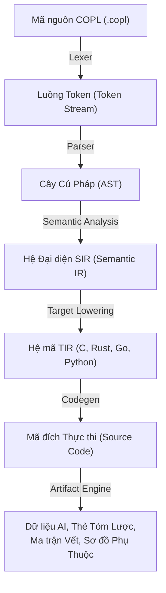

# COPL — Ngôn ngữ Lập trình Hướng Ngữ cảnh (Context-Oriented Programming Language)
## Tổng Quan Dự Án

> **Phiên bản**: 1.0 | **Trạng thái**: Giai đoạn Lên Đặc tả (Specification Phase) | **Cập nhật lần cuối**: 2026-04-05

---

## 1. COPL Là Gì?

COPL (Context-Oriented Programming Language) là một **nền tảng ngôn ngữ lập trình mới** được thiết kế với nguyên lý cốt lõi:

> **Ngữ cảnh (Context) là thành phần cấu trúc ưu tiên (first-class citizen)** — yêu cầu (requirement), quyết định thiết kế (decision), tác vụ công việc (workitem), rủi ro hệ thống (risk), và quyền sở hữu (ownership) cùng tồn tại với mã nguồn (code). Chúng được trình biên dịch phân tích và xác minh chéo.

COPL không chỉ là một cú pháp ngôn ngữ mới, COPL là một **nền tảng ngôn ngữ (language platform)** bao gồm:
- **Ngôn ngữ** cung cấp cú pháp thời gian chạy (runtime syntax) + cú pháp mô tả ngữ cảnh (context syntax) + cú pháp hợp đồng phần mềm (contract syntax).
- **Trình Biên dịch (Compiler)** đa tầng: Mã nguồn (Source) → Biểu diễn trung gian mức ngữ nghĩa (SIR) → Biểu diễn trung gian đích (TIR) → Sinh mã (Codegen).
- **Hệ thống Tạo Phái sinh (Artifact Engine)**: Xuất các thông tin tóm tắt (summary cards), ma trận dấu vết (trace matrix), sơ đồ phụ thuộc (dependency graph), và tập hợp dữ liệu dành cho AI.
- **Trình Quản lý Gói (Package Manager - `copm`)**: Tích hợp chặt chẽ việc quản lý cấu hình (profile) và định tuyến thiết bị nền tảng (target selection).
- **Hỗ trợ Công cụ Tích hợp (IDE Support)** thông qua Giao thức máy chủ ngôn ngữ (Language Server Protocol - LSP).

## 2. Mục Tiêu Thiết Kế COPL

### Vấn đề hiện tại trong quá trình phát triển

Các ngôn ngữ hiện tại trong giới kỹ thuật (như C, Rust, Go, Python) rất mạnh trong việc xử lý logic tính toán nhưng **thường thiếu hụt thông tin về bối cảnh dự án (project context)**:

| Thông tin vòng đời phần mềm | Nơi lưu trữ hiện trạng | Hạn chế đang gặp phải |
|---|---|---|
| Yêu cầu tính năng (Requirements) | Tập tin tài liệu (Word/PDF/Jira) | Tách rời khỏi mã nguồn hệ thống. |
| Quyết định kiến trúc (Architecture decisions) | Nền tảng chia sẻ (Confluence/Slack) | Bị phân tán và thất lạc theo thời gian. |
| Tiến độ công việc (Work progress) | Theo các hạng mục (Jira tickets) | Không phản ánh trực tiếp trong mã nguồn. |
| Cơ sở suy luận an toàn (Safety rationale) | Hệ thống tài liệu tách biệt (Separate docs) | Khó khăn cho trình biên dịch xác minh. |
| Ràng buộc thiết kế (Design constraints) | Cất giữ trong các chú thích rải rác | Dễ dàng lỗi thời khi code thay đổi (Outdated codes). |

### Giải pháp kỹ thuật của COPL

Thông qua việc gắn kết ngôn ngữ cấu trúc, TẤT CẢ thông tin trên **tồn tại đồng bộ cùng mã nguồn**, được **bộ trình biên dịch (compiler) đánh giá xác minh**, và **tự động thiết xuất thành dữ liệu cấu trúc (artifacts)** để các hệ thống AI phân tích:

```copl
module services.safety.monitor {
  @context {
    purpose: "Hệ thống theo dõi độ an toàn độc lập dành cho EVCU"
    owner: team.safety
    status: stable
    safety_class: ASIL_B
  }
  @trace {
    trace_to: [REQ-SAFETY-001, REQ-SAFETY-002]
    decided_by: [D-ARCH-003]
    verified_by: [T-SAFETY-001, T-SAFETY-002]
  }

  fn check_safety(voltage: U32, current: U32) -> SafetyStatus
    @contract {
      pre: [voltage > 0]
      post: [result.fault_active == (voltage > MAX_VOLTAGE || current > MAX_CURRENT)]
      latency_budget: 1ms
    }
    @effects [pure]
  { ... }
}
```

Trình biên dịch (Compiler) sẽ phân tích các đoạn mã kết hợp này để:
- ✅ Xác nhận tính toàn vẹn của kiểu định nghĩa hàm và điều kiện hợp đồng (types, contracts).
- ✅ Cảnh báo hoặc báo lỗi nếu phát hiện vi phạm quy tắc hệ thống Profile (Ví dụ Profile `embedded` sẽ vô hiệu hóa việc cấp phát vùng nhớ Heap tĩnh).
- ✅ Dịch mã nguồn gốc trên thành mã nguồn thiết bị đích chuẩn để thực thi.
- ✅ Tạo ma trận liên kết giữa các mã thiết kế: REQ-SAFETY-001 → hàm `check_safety()` → test T-SAFETY-001.
- ✅ Xuất các tập hợp từ khóa cấu trúc (summary card) để trợ giúp việc truy xuất tài liệu của các AI agents.

## 3. Đặc Quyền Hệ Sinh Thái Bổ Trợ (Unique Value Proposition)

| Tính năng cốt lõi | C | Rust | Go | **COPL** |
|---|:---:|:---:|:---:|:---:|
| Cơ chế liên kết thực thể Ngữ cảnh tại ngôn ngữ | ❌ | ❌ | ❌ | ✅ |
| Trình biên dịch theo vết nguồn gốc dự án (Context Aware) | ❌ | ❌ | ❌ | ✅ |
| Dữ liệu hỗ trợ gốc thiết kế riêng cho Trí AI đọc (AI-native artifacts) | ❌ | ❌ | ❌ | ✅ |
| Hệ rà vết Trace linking đánh dấu trong code | ❌ | ❌ | ❌ | ✅ |
| Bộ Dịch tự động Hạ cấp hướng tương thích đa thiết bị (Multi-target lowering) | ❌ | ❌ | ❌ | ✅ |
| Cấu hình đóng vùng (Profile configurations) cho embedded/backend | ❌ | Một phần | ❌ | ✅ |
| Giao kèo điều kiện (Contract system) xác minh khi code | ❌ | Một phần | ❌ | ✅ |

## 4. Kiến Trúc Tổng Thể Hệ Thống Biên Dịch



## 5. Hệ Thống Các Cấu Hình Bảo Mật (Profile System)

COPL cung cấp 5 cấu hình bảo mật chính (profiles), mỗi kiểu cấu trúc Profile tương ứng với một mô hình kiểm soát quyền thực thi thiết bị cụ thể:

| Kiểu Profile | Định hướng Nền tảng (Target) | Cơ chế Cấp phát bộ nhớ | Quyền Quản lý Tác vụ Ảnh hưởng (Effects) |
|---|---|---|---|
| `portable` | Thuật toán và Logic dùng chung trên đa nền tảng | Đa dạng | Chỉ duy nhất `pure` |
| `embedded` | Vi điều khiển (MCU) / Hệ thống nhúng thời gian thực (RTOS) | Cố định `static` | Mở tính năng `pure, register, interrupt` |
| `kernel` | Lập trình cấp lõi Hệ điều hành (OS Drivers/Kernel) | `static/owned` | Cho phép truy cập mở `pure, register, interrupt, panic` |
| `backend` | Xây dựng dịch vụ mạng, Server/API Cloud | Lọc bộ nhớ linh hoạt `owned/managed` | Tất cả hệ thiết bị mạng IO `pure, io, heap, network, fs, async` |
| `scripting` | Công cụ nhỏ (Tooling) / Mã lệnh thao tác điều khiển nhỏ lẻ | Ủy thác thông qua `managed` | Không che giấu/Phạm vi kiểm soát mở All |

## 6. Thị Trường Mục Tiêu

**Mục tiêu Chính (Primary Focus)**: Phát triển Công nghiệp phần mềm Nhúng (Embedded Software), lĩnh vực Hệ thống Xe máy/Ô-tô (Automotive), và hệ thống quản lý có rủi ro về mạng sống tuân thủ các quy tắc bảo mật kỹ thuật (Safety-critical theo chuẩn ISO 26262, DO-178C).
**Mục tiêu Thứ cấp (Secondary Focus)**: Ứng dụng để viết cấu trúc lõi trong các hệ quản trị Máy chủ dịch vụ (Backend systems).
**Định hướng Tương lai (Tertiary Focus)**: Cung cấp nền tảng chuẩn tối ưu hoàn toàn chuỗi thao tác kề bên AI dành để Tự động thay dòng rà soát (AI-assisted developers).

## 7. Cấu Trúc Tài Liệu Của Hệ Thống COPL

Mời bạn tham khảo thứ tự các thông số theo đường dẫn thư mục chuyên sâu bên dưới:

```
docs/copl/
├── 00_overview.md              ← TÀI LIỆU TỔNG QUAN HIỆN TẠI
├── 01_grammar_spec.md          ← Chi tiết Bộ quy chuẩn cú pháp phân bổ bằng luật cấu hình tiêu chuẩn Formal EBNF
├── 02_type_system.md           ← Khái quát mô hình kiểm tra hệ thống theo kiểu dữ liệu liên hàm (bidirectional typing)
├── 03_effect_system.md         ← Mô hình ràng buộc khả năng thao tác phần cứng bởi Effect System
├── 04_sir_schema.md            ← Kiến trúc lớp Biểu Diễn Mức Ngữ Nghĩa (SIR Object Model)
├── 05_operational_semantics.md ← Khung Mô hình Phân tầng Hành vi Động trong quá trình triển khai (Execution Model)
├── 06_memory_concurrency.md    ← Phương pháp Phân quyền Cấp phát Bộ nhớ và Xử lý Đa luồng (Concurrency Rules)
├── 07_lowering_spec.md         ← Kỹ thuật hạ nền mã hóa xuống Môi trường Nền tảng Máy Chủ riêng biệt
├── 08_module_error_handling.md ← Kiến trúc Xử lý Cụm thông tin chia cấp và Khởi chạy Phát sinh báo rủi ro Hệ thống
├── 09_compiler_architecture.md ← Cấu trúc sâu bên trong các phân vùng cốt lõi tiến trình qua các bước Biên Dịch
├── 10_artifact_engine.md       ← Cơ chế Tạo sinh Tập dữ liệu Thông tin Tự phác thảo qua Phân quyền (AI Reports)
├── 11_incremental_compilation.md ← Trí thông minh quản trị tối ưu xây dựng biên dịch (Incremental Caching cho dự án quy mô hàng triệu files)
└── 12_test_framework.md        ← Cấu trúc Khung rà soát thử Code Hệ thống nội vi tích hợp
```

## 8. Thuật Ngữ Kỹ Thuật (Glossary)

| Thuật ngữ gốc | Giải thích / Định nghĩa Khái Niệm |
|---|---|
| **SIR** | Biểu diễn Trung gian mức Ngữ Nghĩa (Semantic Intermediate Representation) — Cấu trúc dữ liệu trung tâm nội tại chứa toàn bộ tri thức của dự án. |
| **TIR** | Biểu diễn Trung gian thiết bị Mục Tiêu (Target Intermediate Representation) — Biểu diễn phụ thuộc nền tảng chuẩn bị cho việc sinh mã (C-TIR, Rust-TIR..). |
| **Profile** | Cấu hình Ràng buộc Khả năng thiết bị con (Execution Profile) - quy định danh sách các tính năng ngôn ngữ và Hiệu ứng nào được phép chạy. |
| **Lowering** | Hành động giảm cấp Cú Pháp thiết bị con - cơ chế biên dịch COPL cho phép mã nguồn truy cập thẳng tài nguyên máy ở cấp vô cùng thấp. |
| **Context entity** | Thực thể cấu trúc ngữ cảnh: bao gồm Khối yêu cầu (Requirement), Quyết định (Decision), Công việc (Workitem) và Rủi ro (Risk) vạch đính cùng File chuẩn dự án. |
| **Trace link** | Chuỗi Liên kết xác minh: kết nối từ các Đặc tả yêu cầu → Trực tiếp lên Hàm phân nhánh thiết kế Logic → Gắn qua test cases để chứng thực hàm thỏa mốc yêu cầu lập ra. |
| **Summary card** | Thẻ Tóm Lược Tổng Đài: Bản kết tủa báo cáo gọn nhẹ cho từng cấu thành dự án, mô tả Mục tiêu chức năng (purpose), Tình trạng hiện tại, đánh giá tính an toàn rủi ro (risk score). |
| **AI Bundle** | Gói dự kiện Hệ Thống: là tập hợp dữ liệu tài liệu (Artifacts) được COPL nén và lập chỉ mục riêng cho AI tự chạy nạp rà soát tự động hiểu kết trúc cốt bộ mảng của project. |
| **Effect** | Hiệu ứng phụ bên lề: Hành vi thao tác trực tiếp lên hệ sinh động tài nguyên (IO input/output, Vùng lệnh Heap, Thanh ghi mã Register, Ngắt tác giả Interrupt...). |
| **Contract** | Hợp đồng tính vẹn toàn thực thi logic: Thiết lập ràng buộc đầu tiên (Pre/post conditions), nguyên lý tự do trong hàm (Invariants) cùng hiệu lực quy năng tiêu thụ (Performance budgets). |
