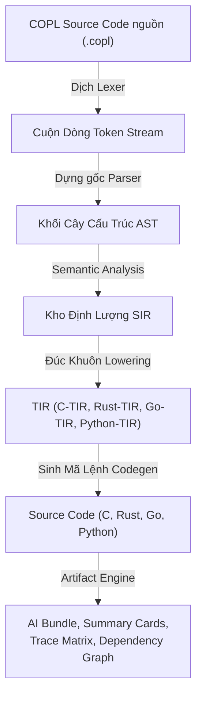

# COPL — Ngôn ngữ Lập trình Hướng Ngữ cảnh (Context-Oriented Programming Language)
## Tổng Quan Dự Án

> **Phiên bản**: 1.0 | **Trạng thái**: Giai đoạn Lên Đặc tả (Specification Phase) | **Cập nhật lần cuối**: 2026-04-03

---

## 1. COPL Là Gì?

COPL (Context-Oriented Programming Language) là một **nền tảng ngôn ngữ lập trình mới** được thiết kế với nguyên lý cốt lõi:

> **Ngữ cảnh (Context) là công dân hạng nhất (first-class citizen)** — yêu cầu (requirement), quyết định (decision), đầu mục công việc (workitem), rủi ro (risk), quyền sở hữu (ownership) cùng tồn tại với mã nguồn (code), được trình biên dịch thấu hiểu và xác minh chéo.

COPL không chỉ là một cú pháp ngôn ngữ mới. COPL là một **nền tảng ngôn ngữ (language platform)** bao gồm:
- **Ngôn ngữ** cung cấp cú pháp thời gian chạy (runtime syntax) + cú pháp ngữ cảnh (context syntax) + cú pháp hợp đồng an toàn (contract syntax)
- **Bộ Biên dịch (Compiler)** đa tầng: Source (Nguồn) → SIR (Trung gian ngữ nghĩa) → TIR (Trung gian đích) → Codegen (Sinh mã)
- **Động cơ Sinh tạo Phái sinh (Artifact Engine)** trả ra tóm tắt thông tin thẻ (summary cards), ma trận vết (trace matrix), sơ đồ phụ thuộc (dependency graph), thư mục AI đọc hiểu (AI bundle)
- **Trình Quản lý Gói (Package Manager - `copm`)** hỗ trợ bám cấu hình (profile) và thiết bị đích (target selection)
- **Hỗ trợ Công cụ IDE (IDE Support)** qua (Language Server Protocol - Giao thức máy chủ ngôn ngữ LSP)

## 2. Tại Sao COPL Tồn Tại?

### Vấn đề hiện nay

Các ngôn ngữ hiện tại trong giới kỹ thuật (C, Rust, Go, Python) rất mạnh về giải quyết logic tính toán nhưng **lại mắc bệnh mất trí nhớ dự án**:

| Thông tin vòng đời | Nơi lưu trữ hiện nay | Vấn đề nan giải khuyết điểm |
|---|---|---|
| Yêu cầu dự án (Requirements) | Cất trên file Word/PDF/Jira | Bị cô lập Tách rời khỏi code |
| Các Quyết định Kiến trúc (Architecture decisions) | Gửi qua Confluence/Slack | Thất lạc Bị mất theo thời gian |
| Tiến độ công việc (Work progress) | Theo các vé Jira tickets | Hoàn toàn Không liên kết với code |
| Cơ sở Biện luận An toàn (Safety rationale) | Hệ tài liệu chéo Separate documents | Không có bên nào dùng compiler xác minh được độ chênh |
| Các Đích đến Ràng buộc (Design constraints) | Cất giấu trên thẻ comments rời rạc | Dễ dàng lỗi thời, Outdated khi code sửa |

### Giải pháp COPL

Bằng ngôn ngữ quy định, TẤT CẢ thông tin trên **Sống cộng sinh trong chính source code**, được **bộ trình biên dịch compiler phán xét xác minh**, và được **tự động sinh xuất thành di sản phần mềm (artifacts) cho công tác AI agent**:

```copl
module services.safety.monitor {
  @context {
    purpose: "Trình rà soát theo dõi Hệ mức An toàn Độc lập dành kết nối cho EVCU"
    owner: team.safety
    status: stable
    safety_class: ASIL_B
  }
  @trace {
    trace_to: [REQ-SAFETY-001, REQ-SAFETY-002]
    decided_by: [D-ARCH-003]
    verified_by: [T-SAFETY-001, T-SAFETY-002]
  }

  fn check_safety(voltage: U32, current: U32) -> SafetyStatus
    @contract {
      pre: [voltage > 0]
      post: [result.fault_active == (voltage > MAX_VOLTAGE || current > MAX_CURRENT)]
      latency_budget: 1ms
    }
    @effects [pure]
  { ... }
}
```

Trình Compiler chỉ cần đọc file văn phạm văn bản code trên và:
- ✅ Xác nhận sự thật của kiểu logic, của hợp đồng an toàn (types, contracts)
- ✅ Đánh giá xác minh xem có vi phạm cấu hình bị cấm không (VD Profile embedded → sẽ cấm không dùng tới cấp phát bộ quản lý Heap)
- ✅ Kết tủa Sinh mã C code sẵn để trỏ luồng đút vào máy tính xài chạy
- ✅ Lập tự động Sinh ma trận theo vết: REQ-SAFETY-001 → `check_safety()` → T-SAFETY-001
- ✅ Trích thẻ Sinh tóm tắt summary card để bơm làm nhiên liệu cho AI đọc

## 3. Lời Hứa Đặc Quyền Giao Tạo (Unique Value Proposition)

| Tính năng cốt lõi | C | Rust | Go | **COPL** |
|---|:---:|:---:|:---:|:---:|
| Thực thể Ngữ cảnh nhúng thẳng ngôn ngữ | ❌ | ❌ | ❌ | ✅ |
| Mã Biên dịch am hiểu rõ ngọn nguồn gốc gác dự án | ❌ | ❌ | ❌ | ✅ |
| Hiện thực Thỏa mãn Khối Đặc tả cho Trí AI đọc (AI-native artifacts) | ❌ | ❌ | ❌ | ✅ |
| Hệ rà vết Dấu hằn nội bộ Code | ❌ | ❌ | ❌ | ✅ |
| Khối quy chụp Mã hạ nền linh hoạt nhiều đích thiết bị (Multi-target lowering) | ❌ | ❌ | ❌ | ✅ |
| Đóng rào Cấu hình Profile linh động (embedded/backend/...) | ❌ | Một phần | ❌ | ✅ |
| Gắn mã đánh dấu Hợp đồng cam kết Tiên quyết (Contract system) | ❌ | Một phần | ❌ | ✅ |

## 4. Kiến Trúc Tổng Thể



## 5. Hệ Thống Các Khối Rào Chắn Profile System

COPL hỗ trợ cài khoán với 5 cấu hình profiles, tương đương mỗi một profile = 1 thiết lập chế độ thực thi cấm vận riêng biệt:

| Kiểu Profile | Đích nhắm cho Ngành/Mảng Target | Chế Độ Bộ Nhớ Phân Quyền | Các Hành Động Effects Bị Khống chế Mở Giới Hạn |
|---|---|---|---|
| `portable` | Logic tuần chay trung tính (mang qua mọi nền tảng) | mọi loại | chỉ cho xài `pure` |
| `embedded` | Dòng vi điều khiển MCU/ Hệ nhúng thời gian thực RTOS | kiểu cứng `static` | Mở chạy tính toán `pure, register, interrupt` |
| `kernel` | Lập trình cấp OS điều phối Driver/HĐH | kiểu `static/owned` | Mở tính năng `pure, register, interrupt, panic` |
| `backend` | Mã Dịch Vụ Server trực/API gọi mở | Quản lý kiểu `owned/managed` | Đủ hệ múa máy `pure, io, heap, network, fs, async` |
| `scripting` | Công Thể Kỹ Năng Ngắn Tooling/Tự Động Automation | Lõi quản trị qua `managed` | Buông rèm cho xài toán loạn all |

## 6. Thị Trường Gắm Đích

**Mục Liêu Lớn Nhất Bắt Nhất (Primary)**: Các Khối công nghiệp lập trình Nhúng (Embedded) / Vi mạch Ô Tô (Automotive) / Công Nghiệp Trọng Yếu Định Đoạt Ngàn Cân Treo Tính Mạng (Safety-critical chuẩn ISO 26262, DO-178C)
**Mục Liêu Phổ Nhì (Secondary)**: Phát triển và Tương tác kỹ thuật lõi Kỹ sư khối Dịch Vụ Mảng sau lưng Backend
**Mục Liêu Đón Bước Cuối Tương Lai (Tertiary)**: Gắn chắp tay kề tay tự động với luồng Dev được Phân Luồng bằng các Cơ chóp AI (AI-assisted workflows)

## 7. Bản Đồ Thư Mục Kho Tàng Tài Liệu COPL

Xin vui lòng tham chiếu bằng đường dẫn đọc theo thứ tự tịnh tiến này:

```
docs/copl/
├── 00_overview.md              ← TÀI LIỆU CỞI MỞ ĐÍCH CHÍNH LÀ FILE HIỆN THỜI BẠN ĐANG COI NÀY
├── 01_grammar_spec.md          ← Bản định dạng bộ quy chuẩn ngữ pháp cực chi tiết Formal EBNF
├── 02_type_system.md           ← Tuyên bộ định danh luồng kiểm duyệt Luật Kiểu Type + bidirectional
├── 03_effect_system.md         ← Cấm rào chắn Bộ cấp phép hiệu ứng effect system (Effect chặn luồng)
├── 04_sir_schema.md            ← Giới mô phỏng biểu tượng object model cho nhân lõi SIR siêu chi tiết
├── 05_operational_semantics.md ← Bộ khung xử lý động phân tầng bước luồng Formal execution model
├── 06_memory_concurrency.md    ← Đánh đu rào cấp bộ nhớ Memory modes + sắp cấp ordering + quản trị luồng concurrency
├── 07_lowering_spec.md         ← Tuyên thuyết về ngôn phong hạ màn đặc thù xuống các Thiết bị target
├── 08_module_error_handling.md ← Đúc gài Module system phân bua bắt Bug Lỗi rành mạch error handling
├── 09_compiler_architecture.md ← Nội tại bí ẩn của lòng mề lõi Compiler bộ dịch siêu việt + cách đẻ sinh chéo hệ code đa ngôn ngữ multi-target
├── 10_artifact_engine.md       ← Cơ pháo Lập trình Tấn đẻ sinh ra các văn cước phụ lục thông tin AI đọc artifacts specs
├── 11_incremental_compilation.md ← Trí khôn vượt lấn Mảng Bộ dịch Incremental build gia tốc cho luồng quy mô code bạc tỷ bytes (large projects)
└── 12_test_framework.md        ← Tổ điểm dàn nhạc các thể loại Đánh Test thử loại chéo ngầm + Khung gõ điều phái Tests Orchestration
```

## 8. Từ Vựng Mở Rộng Dịch Chuyên Danh Bộ Glossary

| Thuật ngữ gốc | Gạch Đích Định nghĩa Khái Niệm |
|---|---|
| **SIR** | Mảng mã Trừu Tượng Ngữ Nghĩa Về Lõi - Semantic Intermediate Representation — Biểu diễn hệ ngữ nghĩa thông dịch ở mức trung tâm đại não |
| **TIR** | Mảng mã IR Đích Target IR — Biểu diễn IR cấp bậc chuyên biệt dùng để chuyển hướng cho từng trạm dịch vụ mục tiêu thiết bị đích (như C-TIR, Rust-TIR...) |
| **Profile** | Hệ Chế độ bảo chóp thực thi cấu hình máy tính, Chế độ này sinh quyền quyết định các dải features/effects nào được chính thức phép châm ngòi bật hiệu |
| **Lowering** | Hành lang cơ chế thủ tục biểu diễn luồng code logic gắt gao đặc hữu từng lớp Target Máy con target-specific (như quyền chạm rờ phần cứng qua register access...) |
| **Context entity** | Bản cấu thành mang giá trị Thực thể ngữ cảnh sống gắn lên COPL: Gồm có bảng yêu cầu (requirement), phiếu phán quyết (decision), hạng mục luồng chia làm việc workitem, phiếu cảnh báo rủi ro (risk) |
| **Trace link** | Cuỗi Xích Giao Tiệp Dấu Vết: Căng Nối Đai Liên kết: requirement → chạm tay code → bám tay vào test chạy → ra tay ghi phiếu decision quyết định |
| **Summary card** | Ấn Rương Phái sinh Trừu Xuất thẻ Artifact tóm tắt gọn thông tin cốt khí cho 1 tấm module (ghi rõ: purpose-mục đích, status-trạng thái, risk score-đánh giá độ chao đảo dự án) |
| **AI Bundle** | Túi rương Gói trọn Cán Lược artifacts tối ưu sẵn chuẩn chỉnh cào nấu ra dọn cho bộ AI agent tự động ngấu nghiến đọc hiểu dự án gãy gọn |
| **Effect** | Biến thiên Tác động Ngoài Lề (Side effect): Nhóm Tác dụng va chạm tương tác như Gọi ra in bảng chữ io, Xin đào cấp phát heap, Chạm mảng mã chíp register, Dội Móc Ngắt Mạch Nhúng interrupt, Bắt dây gửi tín hiệu máy chủ network, Ném chuỗi cờ trễ luồng async... |
| **Contract** | Bản Hiệp Quyết Tuyên Hệ (Pre/post conditions - điều kiện đầu trước / khóa đuôi hàm chặn sau + invariants hằng tính bất biến quy ước + budgets chỉ số vắt kiệt hiệu suất) |
