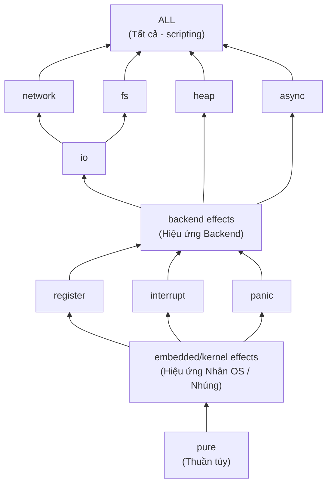

# Đặc tả Hệ thống Hiệu ứng (Effect System) COPL
## Hiệu ứng Gắn với Quyền hạn (Capability-Based Effects) — Khắc phục C3: "Chưa định nghĩa hệ thống hiệu ứng"

> **Trạng thái**: Bản nháp | **Cập nhật lần cuối**: 2026-04-03

---

## 1. Hiệu ứng (Effects) là gì?

Kiến trúc Hệ thống COPL biểu diễn **side effects** (tác dụng phụ) — là những tương tác quan sát được với môi trường ngoài hệ thống tính toán thuần túy. Trong COPL, các hiệu ứng sẽ được:
- **Khai báo (Declared)** đối với hàm thông qua `@effects [...]`
- **Suy luận (Inferred)** tự động từ compiler khi code không được khai báo
- **Xác minh (Checked)** dựa trên profile cấu hình

## 2. Phân loại Hiệu ứng (Taxonomy)

### 2.1 Bộ Hiệu ứng Đầy đủ (Complete Effect Set)

```
Effect = { pure, io, heap, network, fs, interrupt, register, panic, async }
```

| Hiệu ứng | Mô tả | Toán tử / Hàm ví dụ |
|---|---|---|
| `pure` | Trạng thái thuần (không side effects) | Biến đổi tính toán thuần |
| `io` | Gọi I/O console/serial | print(), serial_write() |
| `heap` | Sinh cấp phát bộ nhớ động | Vec::new(), Box::new() |
| `network` | Tương tác socket qua mạng | tcp_connect(), http_get() |
| `fs` | Tương tác tập tin của hệ thống (Filesystem) | file_open(), file_write() |
| `interrupt` | Đóng/mở kích hoạt vi ngắt (Interrupt) | enable_irq(), disable_irq() |
| `register` | Đọc/ghi Hardware register (Thanh ghi) | REG.field = value |
| `panic` | Buộc tiến trình dừng rủi ro đột ngột | panic!(), assert!() |
| `async` | Bất đồng bộ (Async/await) | async fn, .await |

### 2.2 Đồ thị Hệ thống phân cấp Hiệu ứng (Effect Lattice)



`pure` ⊂ Mọi bộ hiệu ứng. Hàm "pure" có thể được dùng trên bất kỳ đâu.

## 3. Ma trận Khả năng Tương thích theo Profile

| Profile | pure | io | heap | network | fs | interrupt | register | panic | async |
|---|:---:|:---:|:---:|:---:|:---:|:---:|:---:|:---:|:---:|
| **portable** | ✅ | ❌ | ❌ | ❌ | ❌ | ❌ | ❌ | ❌ | ❌ |
| **embedded** | ✅ | ❌ | ❌ | ❌ | ❌ | ✅ | ✅ | ❌ | ❌ |
| **kernel** | ✅ | ❌ | ❌ | ❌ | ❌ | ✅ | ✅ | ✅ | ❌ |
| **backend** | ✅ | ✅ | ✅ | ✅ | ✅ | ❌ | ❌ | ✅ | ✅ |
| **scripting** | ✅ | ✅ | ✅ | ✅ | ✅ | ✅ | ✅ | ✅ | ✅ |

## 4. Các quy tắc Suy luận Hiệu ứng

### 4.1 Quy tắc Truyền thông tin

```
(EFFECT-PURE)
    thân hàm không có tác vụ nào tạo ra side-effect
    ────────────────────────────────────────────
    fn f chứa bộ hiệu ứng {pure}

(EFFECT-BODY)
    thân hàm có tác vụ thực hiện và tạo tác động E₁, E₂, ..., Eₙ
    ────────────────────────────────────────────
    fn f chứa bộ hiệu ứng {E₁ ∪ E₂ ∪ ... ∪ Eₙ}

(EFFECT-CALL)
    fn f gọi fn g
    fn g chứa bộ hiệu ứng E_g
    ────────────────────────────────────────────
    fn f chứa bộ hiệu ứng E_f ⊇ E_g    (* hiệu ứng được lan truyền ngược lên trên theo ngữ cảnh *)

(EFFECT-TRANSITIVE)
    fn f gọi fn g, fn g gọi fn h
    fn h chứa bộ hiệu ứng E_h
    ────────────────────────────────────────────
    fn f chứa bộ hiệu ứng E_f ⊇ E_h    (* Tính bắc cầu *)
```

### 4.2 Các quy tắc Xác minh theo Profile

```
(PROFILE-EFFECT-OK)
    fn f nằm trong hệ module M quy định mang profile P
    fn f chứa bộ hiệu ứng E
    E ⊆ allowed_effects(P)
    ────────────────────────────────────────────
    Việc kiểm duyệt thành công cho f

(PROFILE-EFFECT-VIOLATION)
    fn f nằm trong hệ module M quy định mang profile P
    fn f chứa bộ hiệu ứng E
    ∃e ∈ E : e ∉ allowed_effects(P)
    ────────────────────────────────────────────
    COMPILE ERROR (LTL: Biên dịch thất bại): "Hiệu ứng 'e' cấm sử dụng với profile P theo cài đặt ở hàm f"
    Diagnostic code: E301
    Severity: error
    Category: profile
```

### 4.3 Các quy tắc Kiểm tra Chú giải (Annotations) 

```
(EFFECT-ANNOTATION-MATCH)
    fn f khai báo có @effects [E_declared]
    compiler tự suy luận hiệu ứng có sử dụng cho ra E_inferred
    E_inferred ⊆ E_declared
    ────────────────────────────────────────────
    Ghi chú khai báo hợp logic (Khai báo tự cho mình thừa kế tính hiệu ứng)

(EFFECT-ANNOTATION-MISMATCH)
    fn f khai báo có @effects [E_declared]
    compiler tự suy luận hiệu ứng có sử dụng cho ra E_inferred
    ∃e ∈ E_inferred : e ∉ E_declared
    ────────────────────────────────────────────
    CẢNH BÁO: "Hàm f gọi đến hiệu ứng 'e' nhưng bị bỏ sót khỏi danh mục đánh dấu @effects"
    Diagnostic code: W302

(EFFECT-PURE-ANNOTATION)
    fn f khai báo có @effects [pure]
    compiler nhận diện là tác vụ có side effect ra E_inferred
    E_inferred ≠ {pure}
    ────────────────────────────────────────────
    LỖI NGHIÊM TRỌNG: "Hàm f được đánh dấu là pure nhưng dùng hiệu ứng: E_inferred"
    Diagnostic code: E303
```

## 5. Nguồn Sinh của Hiệu ứng

### 5.1 Các hành động cụ thể cho từng loại hiệu ứng

```
register:
  - Đọc/Ghi register qua hàm truy cập low-level (chặn mức phần cứng)
  - Hoạt động của vùng cấp phép volatile memory
  - MIO / Memory-mapped I/O

interrupt:
  - enable_irq(), disable_irq()
  - Lập đăng ký khai báo hệ điều hành liên thông interrupt handler
  - Khởi tạo / đóng Critical section block

heap:
  - Vec::new(), Box::new(), HashMap::new()
  - Mọi sự kiện yêu cầu phân bộ nhớ động alloc
  - Phép nối concat String

io:
  - print(), println()
  - Lệnh gửi Serial/UART port
  - Thao tác gửi/nhận IO trên Console

network:
  - Socket qua đường TCP/UDP/IP
  - Http connections gửi API query
  - Giải mã URL - DNS server resolution

fs:
  - Thao tác cho ổ đĩa/tập tin (File Read/Write/Open)
  - Thay đổi cấp filesystem directory

panic:
  - Marco panic!()
  - Marco chặn luồng assert!()
  - Các lỗi crash hệ thống không cản lại được / Quá mức phục hồi
  - Hàm check chốt chặn unwrapping cho Some().unwrap() / Ok.unwrap() nhưng chốt gặp rỗng (None/Err)

async:
  - Khai báo có đuôi "async fn"
  - Vòng chờ có ".await"
  - Hệ thống tự Spawn tạo tasks ảo qua queue
```

## 6. Sáng tạo Tổ hợp Hiệu ứng

### 6.1 Sự Lan truyền Hiệu ứng xuyên qua Module

```copl
// Module A — hiệu ứng [register]
module mcal.gpio {
  @platform { profile: embedded }
  
  fn set_pin(port: U8, pin: U8) -> Unit
    @effects [register]
  { ... }
}

// Module B — gọi đến nội dung của Module A → Tự thừa kế hiệu ứng [register] theo tính bắc cầu
module bsw.led {
  @platform { profile: embedded }
  use mcal.gpio.set_pin;
  
  fn led_on() -> Unit
    // Khai báo kết luận EFFECTS CÓ SẴN suy từ sự bắc cầu: [register] (Tự kết nối theo logic)
    @effects [register]
  {
    set_pin(0, 13);  // call sang gpio → register hiệu ứng auto bung lên trên
  }
}

// Module C — gọi đến Module B → Cũng sẽ lại tự đính hiệu ứng [register] (dòng họ xa)
module app.indicator {
  @platform { profile: embedded }
  use bsw.led.led_on;
  
  fn signal_ready() -> Unit
    @effects [register]  // lan toả gián tiếp cho app -> led_on → set_pin
  {
    led_on();
  }
}
```

### 6.2 Đường biên Phủ sóng Hiệu ứng

Cảnh báo: Tắt Profile thì sẽ chốt chặn không cho Hiệu ứng tràn từ môi trường này sang môi trường cấm sử dụng:

```
(CROSS-PROFILE-CALL)
    module M1 khai báo chuẩn là profile P1, có thao tác nhúng gọi hàm f nhưng từ module M2 chuẩn cấu hình của P2
    fn f sử dụng bộ hiệu ứng hệ cấp E
    E ⊆ allowed_effects(P1)
    ────────────────────────────────────────────
    Quyền truy cập hàm từ 1 khối ngoài vẫn được ủy quyền gọi bình thường.

    E ⊄ allowed_effects(P1)
    ────────────────────────────────────────────
    LỖI NGHIÊM TRỌNG BIÊN DỊCH: "Cấm khởi tạo và chặn gọi đến thành tố có chức năng tạo hiệu ứng 'e'. Bạn đang lập trình từ khối code quy mô chuẩn P1 vi phạm ràng buộc giới hạn effect"
```

## 7. Các Thuộc tính đảm bảo Sự Toàn vẹn (Soundness Properties)

### 7.1 Tính Đơn điệu của Hiệu ứng (Effect Monotonicity)

> **Định lý**: Việc thêm mã code vào thân hàm có logic chỉ TĂNG thêm số lượng tổ hợp hiệu ứng, tuy nhiên việc "RÚT GIẢM / XÓA BỎ BỚT" thì không thể diễn ra. 
> 
> **Chứng minh**: Hiệu ứng của 1 hàm luôn đại diện bằng "phép GỘP (Union) của mọi hiệu ứng" tính vào thân logic. Mà phép toán hộp là Monotone. ∎

### 7.2 Tính Bảo thủ của Suy luận Hiệu ứng (Effect Conservatism)

> **Định lý**: Khái niệm tính thuần - nếu compiler cho phán quyết cuối cùng theo hàm logic gán biến `fn f has effects {pure}` thì tức code này `f` có Runtime sạch (Sạch vi ngắt/ side-effects).
> 
> **Chứng minh**: Phép suy diễn về độ đo side effects là quá trình thu hẹp giới hạn cao sát sao (Over-approximation). (Kiểm duyệt sẽ ghi cấm hoặc quy trách nhiệm là KHẢ THI là function sẽ bị phát ra cảnh báo khi dùng vi phạm). Phép ước lượng dư vẫn luôn là một quy định tuyệt đối an toàn vì hệ thống compiler chỉ chối từ các code hợp chuẩn logic thuật toán - THAY VÌ - rủi ro duyệt lọt và cấp phép cho khối code chứa mã lỗi đe dọa (hệ thống có thể cho qua lầm). Do đó logic chạy luôn được bao bởi Rule an toàn tuyệt đối. ∎

### 7.3 Tính An toàn của Profile cho Module (Profile Safety)

> **Định lý**: Logic từ 1 module phải đảm bảo thông chốt vượt kiểm định profile checking của hệ thống COPL, nếu thỏa mãn, không thể có chuyện bất kỳ chi tiết module code nào sở hữu mã code sinh các Effect vi hiến trong danh mục được chặn từ profile đó.
> 
> **Chứng minh**: Đã khẳng định bởi tính gộp qua phân bổ phép tính đệ quy truyền thông tin (Transitivity of effect inference) lồng lẫn hệ thống nhận định Profile check khi rà code từ các hàm declaration vào chung điểm gộp để tổng kết toàn vẹn hệ module. ∎
