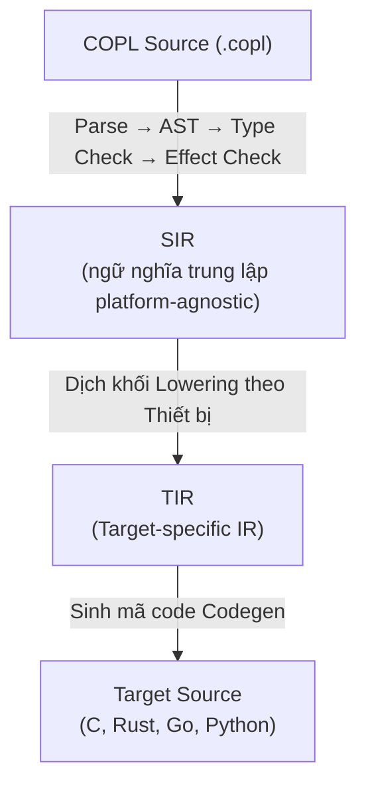

# Đặc tả Khối lệnh Tầng Thấp COPL (Lowering)
## Sinh Mã nguồn (Codegen) theo Thiết bị Đích — Khắc phục C5: "Ngữ nghĩa Lowering quá mơ hồ"

> **Trạng thái**: Bản nháp | **Cập nhật lần cuối**: 2026-04-03

---

## 1. Tổng quan về Lowering

Lowering = cơ chế để thể hiện (express) các khối logic **vận hành chuyên biệt thao tác cấu hình theo phần cứng (target-specific operations)** — những thứ vốn KHÔNG THỂ biểu diễn nổi trên nền tảng lập trình logic trung tính của COPL. Mục đích sử dụng lớn nhất: truy xuất tương tác giao thức phần cứng qua thanh ghi (hardware register access) trên các hệ thống nhúng (embedded systems).



## 2. Cú pháp khối Lower

```copl
lower <function_name>(<params>) [-> <return_type>] @target <target> {
    <target-specific operations>
}
```

### 2.1 Quy tắc

1. Khối lower **chỉ được phép xài** tại các modules thuộc nhóm `profile: embedded` hoặc `profile: kernel`
2. Khối lower **bắt buộc** phải khai báo tường minh gắn mác `@target` — chúng hoàn toàn KHÔNG CÓ TÍNH NĂNG XÀI ĐA NỀN (NOT portable)
3. Các module có chứa khối lower thì tự động phát sinh ép nhận **effect [register]**
4. Các khối lệnh trong lower là một **khối hộp mờ (opaque)** vô hình đối với Type Checker (compiler chỉ tin signature)
5. Tất cả hàm liên kết gọi đến khối code lower đều buộc sẽ mắc tính lây nhiễm qua truyền thừa kế nhận biến `[register]`

### 2.2 Typing Rules Hình thức (Formal Typing Rules) — **[MỚI]**

```
(T-LOWER-DECL)              (* Typing cho lower function *)
    params: [(x₁,τ₁),...,(xₙ,τₙ)]
    τ_ret là kiểu trả về hợp lệ
    target T được khai báo tương thích với profile hiện tại
    ─────────────────────────────────────────
    Γ ⊢ lower f(params) -> τ_ret @target T { opaque_body }
        : fn(τ₁,...,τₙ) -> τ_ret  [effect: {register}]
    
    (* Compiler không type-check opaque_body — đây là trách nhiệm của developer *)
    (* Đây là "escape hatch" có kiểm soát: type safety ở boundary, không ở bên trong *)

(T-LOWER-STRUCT)            (* Typing cho lower_struct — hardware register mapping *)
    fields = [(f₁, τ₁, off₁), ..., (fₙ, τₙ, offₙ)]
    ∀i: τᵢ ∈ {U8, U16, U32, U64} ∨ τᵢ là pointer_type     (* chỉ numeric/pointer là hợp lệ *)
    target T được khai báo tương thích
    ─────────────────────────────────────────
    Γ ⊢ lower_struct S @target T { fields }
    Kết quả: S được thêm vào Γ với tag [lower_struct, target=T]
             *S là kiểu pointer hợp lệ trong context lower (T-LOWER-PTR)

(T-LOWER-CONST)             (* Typing cho lower_const — hardware address constant *)
    τ là pointer_type hoặc numeric type
    addr là INTEGER_LIT hợp lệ (địa chỉ phần cứng thô)
    target T tương thích
    ─────────────────────────────────────────
    Γ ⊢ lower_const x: τ @target T = addr  :  τ  [lower_const, target=T]
    
    (* x chỉ có thể được dùng trong lower context hoặc lower block cùng target *)

(T-LOWER-PTR)               (* Sử dụng pointer type trong lower context *)
    τ là `lower_struct` đã được khai báo
    context hiện tại là lower block hoặc lower_struct/lower_const
    ─────────────────────────────────────────
    Γ ⊢ *τ : pointer_type   (* hợp lệ trong lower context *)
    
    Nếu *τ xuất hiện ngoài lower context → COMPILE ERROR E501 (Pointer outside lower context)
```

## 3. Khối lệnh Hạ tầng bằng mã đích C (C Target Lowering)

### 3.1 Các Khối Nền tảng (Primitives) Truy xuất Thanh ghi 

```copl
// Tương tác đọc điện không thể dự đoán (Volatile read)
lower volatile_read_32(addr: U32) -> U32 @target c {
    return *(volatile uint32_t*)(addr);
}

// Cấp quyền Ghi điện lên vùng biến đổi liên tục (Volatile write)
lower volatile_write_32(addr: U32, value: U32) @target c {
    *(volatile uint32_t*)(addr) = value;
}

// Đọc - biến đổi - lưu (Cài cờ set bit)
lower set_bits(addr: U32, mask: U32) @target c {
    *(volatile uint32_t*)(addr) |= mask;
}

// Đọc - biến đổi - lưu (Xóa cờ dọn mảng bit)
lower clear_bits(addr: U32, mask: U32) @target c {
    *(volatile uint32_t*)(addr) &= ~(mask);
}
```

### 3.2 Quy đổi Cấu trúc vùng Thanh Ghi

```copl
// Bảng định nghĩa Thanh ghi
lower_struct CAN_TypeDef @target c {
    MCR: volatile U32 @offset 0x00,
    MSR: volatile U32 @offset 0x04,
    TSR: volatile U32 @offset 0x08,
    RF0R: volatile U32 @offset 0x0C,
    RF1R: volatile U32 @offset 0x10,
    IER: volatile U32 @offset 0x14,
    ESR: volatile U32 @offset 0x18,
    BTR: volatile U32 @offset 0x1C,
    // ... hộp Mailbox xử lý thanh ghi liên lạc
}

// Con trỏ Base trỏ địa chỉ Gốc
lower_const CAN1: *CAN_TypeDef @target c = 0x40006400;
lower_const CAN2: *CAN_TypeDef @target c = 0x40006800;
```

### 3.3 Mã Code C được Biên dịch Tự động sinh ra (Generated)

```copl
// COPL source:
lower rcc_enable_can1() @target c {
    RCC.APB1ENR |= (1 << 25);
}
```

Phần mã C mà Compiler kết xuất Output:
```c
/* Tự động biên dịch sinh ra bởi COPL compiler. Tuyệt đối không thay thế dữ liệu bằng tay. */
static inline void rcc_enable_can1(void) {
    RCC->APB1ENR |= (1U << 25U);
}
```

### 3.4 Mã Assembly nhúng Inline (Đường thoát Cứu trợ)

```copl
lower disable_interrupts() @target c {
    asm volatile ("cpsid i" ::: "memory");
}

lower enable_interrupts() @target c {
    asm volatile ("cpsie i" ::: "memory");
}

lower get_primask() -> U32 @target c {
    uint32_t result;
    asm volatile ("mrs %0, primask" : "=r"(result));
    return result;
}
```

## 4. Quá trình Quy đổi Hệ SIR → hệ TIR (Target IR)

### 4.1 Cấu trúc của TIR

```yaml
TIR-C:
  includes: list[str]          # "#include <stdint.h>", v.v.
  type_defs: list[TIRTypeDef]  # các biến khai khối struct/enum/typedef
  function_decls: list[TIRFunctionDecl]
  function_defs: list[TIRFunctionDef]
  global_vars: list[TIRGlobalVar]
  register_defs: list[TIRRegisterDef]

TIRFunctionDef:
  name: str
  return_type: CType
  params: list[(str, CType)]
  body: list[TIRStatement]
  is_static: bool
  is_inline: bool
  attributes: list[str]       # "__attribute__((weak))", v.v.
```

### 4.2 Bảng Chuyển đổi Kiểu Type Mapping: COPL → C

| COPL Type | C Type | Cú pháp Ghi chú |
|---|---|---|
| `Bool` | `bool` (stdbool.h) | hoặc là `uint8_t` cho môi trường nhúng |
| `U8` | `uint8_t` | |
| `U16` | `uint16_t` | |
| `U32` | `uint32_t` | |
| `U64` | `uint64_t` | |
| `I8` | `int8_t` | |
| `I16` | `int16_t` | |
| `I32` | `int32_t` | |
| `I64` | `int64_t` | |
| `F32` | `float` | |
| `F64` | `double` | |
| `[T; N]` | `T[N]` | Mảng độ lớn cố định fixed array |
| `T?` | Khối struct lồng gắn cờ flag trạng thái | `struct { bool has_value; T value; }` |
| `Result<T,E>` | Tagged union | `struct { bool is_ok; union { T ok; E err; }; }` |
| `Unit` | `void` | |
| struct S | `typedef struct` | |
| enum E (không gắn biến field) | `typedef enum` | |
| enum E (có mang biến fields nội hàm) | tagged union | |

### 4.3 Những mẫu quy ước Lowering cho Enum

```copl
// Biến thể kiểu Enum không ôm kiểu giá trị sẽ biến hóa → qua khối C enum
enum CanStatus { Ok, Busy, Error, Timeout }
```
```c
// Mã C được phát sinh Generation:
typedef enum {
    CanStatus_Ok = 0,
    CanStatus_Busy = 1,
    CanStatus_Error = 2,
    CanStatus_Timeout = 3
} CanStatus;
```

```copl
// Biến thể kiểu Enum có biến khai sinh bên trong → chuyển dạng union tag (tagged union)
enum Result<T, E> {
    Ok(T),
    Err(E)
}
```
```c
// Mã C được phát sinh Generation:
typedef struct {
    bool is_ok;
    union {
        T ok;
        E err;
    } data;
} Result_T_E;
```

### 4.4 Quy chế Lower cho State Machine 

```copl
state_machine VcuStateMachine {
    initial: VcuState::Park
    transition Park + KeyOn => Ready action: prepare_drive
    transition Ready + ShiftToDrive => Drive action: enable_motor
}
```

Mã C được định tuyến:
```c
typedef void (*sm_action_fn)(VcuContext*);

typedef struct {
    VcuState from;
    VcuEvent event;
    VcuState to;
    sm_action_fn action;
} VcuTransition;

static const VcuTransition vcu_transitions[] = {
    { VcuState_Park,  VcuEvent_KeyOn,        VcuState_Ready, prepare_drive },
    { VcuState_Ready, VcuEvent_ShiftToDrive,  VcuState_Drive, enable_motor },
    // ... và nhiều nhánh transition khác
};

VcuState vcu_process_event(VcuState current, VcuEvent event, VcuContext* ctx) {
    for (size_t i = 0; i < ARRAY_SIZE(vcu_transitions); i++) {
        if (vcu_transitions[i].from == current && 
            vcu_transitions[i].event == event) {
            vcu_transitions[i].action(ctx);
            return vcu_transitions[i].to;
        }
    }
    return current;  // giữ nguyên mốc hiện tại nếu code không thấy transition hợp lệ
}
```

### 4.5 Biên dịch Tầng Hợp Đồng (Contract Lowering)

```copl
fn divide(a: I32, b: I32) -> I32
    @contract {
        pre: [b != 0]
        post: [result * b == a]
    }
{ return a / b; }
```

Mã Sinh bằng C khi biên dịch ở Debug mode:
```c
int32_t divide(int32_t a, int32_t b) {
    /* KIỂM TRA PRE-CONTRACT */
    COPL_ASSERT(b != 0, "Precondition failed: b != 0 at divide:line 1");
    
    int32_t __result = a / b;
    
    /* KIỂM TRA POST-CONTRACT */
    COPL_ASSERT(__result * b == a, "Postcondition failed at divide:line 1");
    
    return __result;
}
```

## 5. Hỗ trợ Quản trị Đa máy mục tiêu (Multi-Target Support)

### 5.1 Chọn Cấu hình Riêng với Block Target Lower

```copl
module mcal.gpio {
    // Chỉ là 1 function, lại mang khối hạ biến chuyên biệt phục vụ từng đích thiết bị target
    lower set_pin_high(port: U8, pin: U8) @target c {
        GPIO_PORT[port]->BSRR = (1 << pin);
    }
    
    lower set_pin_high(port: U8, pin: U8) @target rust {
        unsafe { 
            (*GPIO_PORT[port as usize]).bsrr.write(|w| w.bits(1 << pin));
        }
    }
}
```

### 5.2 Khai mở Tiến trình Lựa chọn Chọn Khối Build Target 

```bash
copm build --target c        # build ra .c files
copm build --target rust     # build code Rust .rs files
copm build --target go       # build thư mục cho code .go 
```

Trình biên dịch chỉ pick (lựa) đúng cái block lệnh `@target` phù hợp với yêu cầu Compile mà thôi. Tái tạo ra những cái bị trống block missing hạ tầng lower → COMPILE ERROR.
