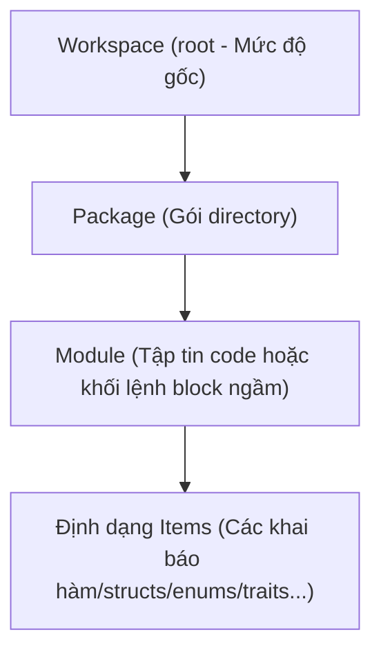

# Hệ thống Module & Cơ chế Bắt Lỗi COPL
## Khắc phục C8+C9: "Không có định nghĩa xử lý lỗi" + "Hệ thống module chỉ là hàng test ví dụ"

> **Trạng thái**: Bản nháp | **Cập nhật lần cuối**: 2026-04-03

---

## 1. Hệ thống Phân bổ Module (Module System)

### 1.1 Cấu trúc Phân cấp (Module Hierarchy)



COPL tuân thủ **cấu trúc một-file-một-module** như một cơ chế mặc định, hỗ trợ module lồng nhau khi cần thiết.

### 1.2 Hiển thị Đường dẫn Liên kết Module Paths

```
File lưu: mcal/can_driver.copl → truy xuất code thành: module mcal.can_driver
File lưu: services/vcu/state_machine.copl → module trỏ tới: services.vcu.state_machine
```

Tên Module được định tuyến từ cây thư mục (thay thế dấu `/` bằng dấu chấm `.`) và bỏ đuôi `.copl`.

### 1.3 Cơ chế Cấp quyền Truy xuất Public/Private (Visibility)

```copl
module mcal.can {
  // Public — Cấp quyền truy xuất công khai cho các module bên ngoài
  pub struct CanPdu { ... }
  pub fn init(config: CanConfig) -> CanStatus { ... }
  
  // Private (Riêng tư) — Chỉ truy cập được nội bộ bên trong module (mặc định)
  fn find_empty_mailbox() -> Option<U8> { ... }
  struct InternalState { ... }
}
```

Quy tắc truy cập:
```
(VISIBILITY-PUB)
    Item có nhãn `pub`
    ─────────────────────────────
    Cho phép import và móc nối từ bất kỳ module nào 

(VISIBILITY-PRIVATE)
    Item không có nhãn `pub`
    ─────────────────────────────
    Chỉ giao tiếp ở nội bộ module sở tại

(VISIBILITY-IMPORT)
    Module A cố import một private item từ module B
    ─────────────────────────────
    BÁO LỖI BIÊN DỊCH COMPILE ERROR E501: "Vi phạm quyền truy cập riêng tư. Không thể tham chiếu đến private item 'x' của module 'B'"
```

### 1.4 Lệnh cấu hình nhập Use (Import System)

```copl
// Import một item đơn lẻ
use mcal.can.CanPdu;

// Import nhiều items cùng lúc
use mcal.can.{CanPdu, CanStatus, init};

// Định nghĩa Alias 
use mcal.stm32f407.can as hw_can;

// Wildcard import (Không khuyến khích)
use mcal.can.*;
```

### 1.5 Cấm Đoán Mối quan hệ xoắn vặn (Module Dependencies)

```
Logic hợp lệ (Allowed): Thiết kế hướng từ tầng cấp cao gọi xuống tầng thấp.
          app → services → bsw → mcal

Nghiêm cấm (Forbidden): Phụ thuộc vòng (Circular dependencies)
           mcal.can → bsw.canif → mcal.can  // ❌ LỖI VÒNG LẶP

Phương thức rà soát:
  Trình biên dịch thiết lập đồ thị phụ thuộc (dependency graph) khi xây dựng nền tảng SIR.
  Nếu phát hiện một dependency cycle → COMPILE ERROR E502: "Phát hiện Phụ thuộc vòng: A → B → A"
```

### 1.6 Xác thực Khước Từ/Kích hoạt Giao Thức Interface thông qua Trait (Trait Enforcement)

```copl
// Khai báo giao diện (Interface)
pub trait CanDriver {
  fn init(config: CanConfig) -> CanStatus;
  fn write(pdu: CanPdu) -> CanStatus;
  fn read() -> Result<CanPdu, CanStatus>;
}

// Module triển khai bắt buộc phải thể hiện đầy đủ giao diện
module mcal.stm32f407.can {
  @trace { implements: [CanDriver] }
  
  // Trình biên dịch kiểm tra tính đầy đủ của các hàm trong giao diện CanDriver
  impl CanDriver for McalCan {
    fn init(config: CanConfig) -> CanStatus { ... }
    fn write(pdu: CanPdu) -> CanStatus { ... }
    fn read() -> Result<CanPdu, CanStatus> { ... }
  }
}
```

## 2. Hệ Thống Quản Trị và Xử Lý Lỗi (Error Handling)

### 2.1 Triết lý Xử lý Lỗi

COPL kế thừa tư duy của ngôn ngữ Rust: **Lỗi được quản trị như là một biến giá trị, ngăn chặn hoàn toàn tư duy ném ngoại lệ (Exceptions) không lường trước**.

| Cơ chế | Trường hợp sử dụng | Giới hạn Profile |
|---|---|---|
| `Result<T, E>` | Biểu thị Lỗi có khả năng phục hồi được (Recoverable error) | Tất cả profile |
| `Option<T>` | Định nghĩa giá trị tùy chọn / thay thế Null | Tất cả profile |
| `panic` | Lỗi hủy diệt nghiêm trọng không thể phục hồi | Bị chắn trên môi trường embedded / Chỉ cho phép với kernel, backend |
| Contract | Bắt lỗi bất quy tắc / lỗi hệ quy chiếu số liệu | Quản trị dựa vào thiết lập biên dịch |

### 2.2 Kiểu Dữ liệu Định Vị kết quả Output Result

```copl
enum Result<T, E> {
  Ok(T),
  Err(E)
}

// Logic tạo phân luồng lỗi chuẩn mã code:
fn divide(a: I32, b: I32) -> Result<I32, MathError> {
  if b == 0 {
    return Err(MathError::DivisionByZero);
  }
  return Ok(a / b);
}

// Logic đẩy bắt lỗi (Error Propagation)
fn caller() -> Result<I32, MathError> {
  let result = divide(10, 0)?;  // Toán tử ? tự động giải cấu trúc (unwrap Ok) hoặc ném lỗi (bubble up Err) lên hàm mẹ
  return Ok(result * 2);
}
```

### 2.3 Phép Tính Đẩy Tràn Lỗi Propagation (Toán Tử Dấu Hỏi ?)

```
(TRY-PROPAGATE)
    Biểu thức `e` có hệ chuẩn là type `Result<T, E>`
    Hàm hiện tại được khai báo trả về hệ thống `Result<_, E>`
    
    e? 
      = nếu e mang giá trị Ok(v) → Tách lưu giá trị biến v 
      = nếu e mang tín hiệu báo lỗi Err(err) → Hàm con lập tức return vứt trả luồng điều khiển cùng với lỗi Err(err)
```

### 2.4 Quản trị Mảng Phân Loại Error Types

```copl
// Tự định nghĩa cấu trúc mảng mã lỗi (domain-specific error types)
enum CanError {
  Timeout,
  BusOff,
  MailboxFull,
  InvalidDlc(U8),
  HardwareError { code: U16, register: U32 }
}

// Hàm khai báo mã lỗi cụ thể có thể xảy ra
fn can_write(pdu: CanPdu) -> Result<Unit, CanError> {
  if !is_initialized() { return Err(CanError::BusOff); }
  if pdu.dlc > 8 { return Err(CanError::InvalidDlc(pdu.dlc)); }
  // ...
}
```

### 2.5 Logic Hạn Chế Error Tại Embedded (Lệnh Tước bỏ Panic)

```copl
module mcal.can {
  @platform { profile: embedded }
  
  // Trong môi trường profile nhúng (embedded): CẤM API sinh PANIC, CẤM hàm unwrap(), CẤM expect().
  // Mọi luồng xử lý tiềm ẩn ngoại lệ phải sử dụng toán tử ? và Result type rõ ràng.
  
  fn safe_read() -> Result<CanPdu, CanError> {
    let mailbox = find_empty_mailbox();
    match mailbox {
      Some(mb) => { ... return Ok(pdu); },
      None => { return Err(CanError::MailboxFull); }
    }
    // Dòng lệ code sau là thao tác cấm tại môi trường embedded
    // let mb = mailbox.unwrap();  // ❌ TẠO SỰ CỐ PANIC LỖI BIÊN DỊCH
  }
}
```

Màn hình Compiler sẽ bật rào rát (enforcement):
```
(NO-PANIC-EMBEDDED)
    Module sở hữu định dạng profile = embedded
    Logic xác định sử dụng các API: unwrap(), expect(), panic!(), assert!()
    ─────────────────────────────
    LẬP TỨC PHÁT LỖI BIÊN DỊCH COMPILE ERROR E601: "Cấm sử dụng hàm sinh cấu trúc panic đối với profile 'embedded'"
```

### 2.6 Khối Logic Nắn Luồng Đổi Kiểu Lỗi Mượt Mà (Error Conversion)

```copl
// Tích hợp Trait From để thiết lập logic chuyển đổi tự động
impl From<CanError> for SystemError {
  fn from(e: CanError) -> SystemError {
    match e {
      CanError::Timeout => SystemError::CommTimeout("CAN"),
      CanError::BusOff => SystemError::HardwareFault("CAN bus off"),
      _ => SystemError::Unknown
    }
  }
}

// Có thể dùng toán tử `?` dễ dàng chuyển đổi Error qua kiểu mới
fn system_init() -> Result<Unit, SystemError> {
  can_init(config)?;  // Logic sẽ tự chèn luồng casting dữ liệu lỗi bằng trait From
  gpio_init()?;
  return Ok(Unit);
}
```

### 2.7 Option Type (Kiểu tùy chọn dữ liệu)

```copl
// T? Là định dạng cú pháp đường (syntax sugar) của Option<T>

fn find_module(name: String) -> ModuleInfo? {
  for m in modules {
    if m.name == name { return Some(m); }
  }
  return None;
}

fn caller() {
  let info = find_module("mcal.can");
  match info {
    Some(m) => { use_module(m); },
    None => { log("module not found"); }
  }
  
  // Hay dùng mẹo Ràng Buộc Cú pháp mẫu if-let pattern gộp nhánh:
  if let Some(m) = find_module("mcal.can") {
    use_module(m);
  }
}
```

## 3. Hệ Thống Mã Lỗi Biên Dịch (Diagnostic Codes)

Phân bổ Mã chuẩn Lỗi Compile cho khả năng chẩn đoán tự động hóa của máy công cụ ngoài:

```
Lỗi Cú pháp Syntax:                      E001-E099
Lỗi Xác định chuẩn định nghĩa Type Mismatch: E100-E199
Lỗi Vi Phạm Cấu hình hiệu ứng Effect:        E300-E399
Lỗi Quản Trị Bộ Nhớ Memory Check:            E400-E499
Lỗi Chu trình Module Dependencies:           E500-E599
Lỗi Giới hạn Error Handling Management:      E600-E699
Lỗi Quy tắc Check Tiền/Hậu Quyết Contract:   E700-E799
Lỗi Quy tắc Biên dịch Lowering Target:       E800-E899
Lỗi Ánh xạ hệ chuẩn Context/Tags:            E900-E999

Các Mã Warning (Hỗ trợ cấu trúc Style):      W001-W999
```

### Bảng Mã Diagnostic Cốt Lõi

| Ký Tự Hiệu Code | Hạng Mục Code (Category) | Dòng Message Định Tuyến Nền Tảng |
|---|---|---|
| E001 | syntax | Unexpected token '{tok}', expected '{expected}' |
| E002 | syntax | Unterminated string literal |
| E101 | type | Type mismatch: expected '{expected}', found '{found}' |
| E102 | type | Cannot apply operator '{op}' to types '{lhs}' and '{rhs}' |
| E103 | type | Unknown type '{name}' |
| E104 | type | Missing return type annotation |
| E301 | effect | Effect '{effect}' is not allowed in profile '{profile}' |
| E302 | effect | Pure function uses effect '{effect}' |
| E401 | memory | Heap allocation is forbidden in static memory mode |
| E402 | memory | Use after free detected for Owned<{type}> |
| E501 | module | Access violation: item '{item}' is private in module '{module}' |
| E502 | module | Circular dependency detected: {cycle} |
| E503 | module | Module '{name}' not found |
| E601 | error | Panic-inducing operations are forbidden in profile 'embedded' |
| E701 | contract | Precondition failed: {condition} |
| E901 | context | Requirement reference '{id}' is undefined |

Mỗi dòng thông điệp báo Bug Diagnostic sẽ bao trùm gồm: code lỗi, phân nhóm category, độ nghiêm trọng severity, vị trí File file/line/column, dòng diễn tả message lỗi và kèm theo 1 chuỗi gợi ý debug suggested_fix.

---

## 7. Quy tắc Gọi Qua Ranh Giới Profile (Cross-Profile Call Rules) — **[MỚI]**

### 7.1 Ma Trận Cho Phép Gọi Qua Profile

| Caller Profile | Callee Profile | Điều kiện | Kết quả |
|---|---|---|---|
| `embedded` | `portable` | effects của callee ⊆ {pure, register} | ✅ Hợp lệ |
| `embedded` | `embedded` | same profile | ✅ Hợp lệ |
| `embedded` | `kernel` | — | ❌ E510 |
| `embedded` | `backend` | — | ❌ E510 |
| `kernel` | `embedded` | effects ⊆ {pure, register, interrupt} | ✅ Hợp lệ (supervisor call) |
| `backend` | `portable` | effects ⊆ {pure, heap, io} | ✅ Hợp lệ |
| `backend` | `embedded` | — | ❌ E510 |

### 7.2 Formal Rule (Cross-Profile Call Typing)

```
(CROSS-PROFILE-CALL-ALLOWED)
    module A: profile=P_A
    module B: profile=P_B
    B.f : fn(params) -> τ  [effects: E_B]
    E_B ⊆ allowed_effects(P_A)      (* B's effects không vượt quá những gì A được phép *)
    ────────────────────────
    A được phép gọi B.f
    Resulting call effect = E_B ∪ current_effects(A)

(CROSS-PROFILE-CALL-FORBIDDEN)
    module A: profile=P_A
    module B: profile=P_B
    E_B ⊄ allowed_effects(P_A)      (* B có effects mà A không được phép *)
    ────────────────────────
    COMPILE ERROR E510: Cross-profile call effect violation:
    "Profile '{P_A}' không được phép gọi hàm có effect '{E_B - allowed_effects(P_A)}'"
```

### 7.3 Bảng `allowed_effects(profile)`

```
embedded:  {pure, register, interrupt}
kernel:    {pure, register, interrupt, heap}     (kernel có quyền alloc cho kernel objects)
portable:  {pure}                                (portable = không có side effect gì cả)
backend:   {pure, heap, io, network, fs, async}
scripting: {pure, heap, io, network, fs, async, panic}
```

---

## 8. Ngữ nghĩa Wildcard Import (Wildcard Import Semantics) — **[MỚI]**

```
(USE-WILDCARD)
    module M có public symbols S = {s₁: τ₁, s₂: τ₂, ..., sₙ: τₙ}
    'use M.*' được khai báo trong module A
    ────────────────────────
    Tất cả sᵢ ∈ S được thêm vào scope của A như thể khai báo 'use M.sᵢ'

(USE-WILDCARD-CONFLICT)
    'use M.*' đưa sᵢ vào scope
    scope của A đã có symbol sᵢ (từ local def hoặc use khác)
    ────────────────────────
    COMPILE ERROR E301: "Ambiguous import: '{sᵢ}' tồn tại trong cả local scope và 'M.*'"
    Cách giải quyết: dùng 'use M.{sᵢ} as M_sᵢ' để explicit rename

(USE-WILDCARD-DISCOURAGED)
    'use M.*' detected
    ────────────────────────
    WARNING W101: "Wildcard import 'use M.*' có thể gây shadowing không rõ ràng.
    Khuyến nghị: dùng explicit import 'use M.{item1, item2}' để rõ ràng hơn."
    (* Warning không block build — chỉ cảnh báo style *)
```

> **Lý do có WARNING**: Wildcard import được hỗ trợ vì đôi khi cần thiết (ví dụ import toàn bộ HAL functions), nhưng khuyến nghị dùng explicit import để tăng readability và tránh accidental shadowing.

---

### Cập nhật Bảng Error Codes

| Code | Category | Mô tả |
|---|---|---|
| E301 | import | Ambiguous import — wildcard conflict |
| E501 | module | Access violation — private item |
| E501 | pointer | Pointer type outside lower context |
| E502 | module | Circular dependency detected |
| E503 | module | Module not found |
| E503 | effect | critical_section outside embedded/kernel profile |
| E510 | profile | Cross-profile call effect violation |

