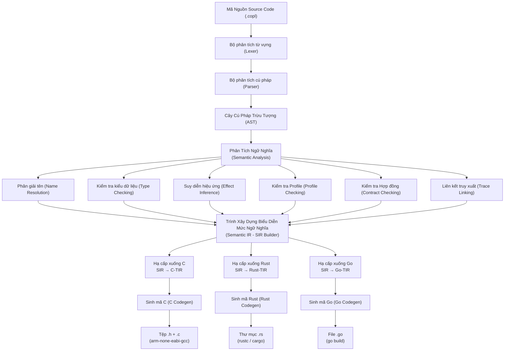

# Kiến trúc Trình Biên Dịch (Compiler Architecture) của COPL

## Pipeline Biên Dịch Hỗ trợ Đa Nền Tảng (Multi-Target) — Giải quyết C10: "Khoảng trống Ngữ Nghĩa giữa các Cấu Hình Build"

> **Trạng thái**: Bản nháp | **Cập nhật lần cuối**: 2026-04-05

---

## 1. Luồng Xử Lý (Pipeline) của Trình Biên Dịch



## 2. Chi Tiết Các Giai Đoạn (Phase Details)

### Giai Đoạn 1: Lexer (Chuyển đổi chuỗi ký tự thành luồng Token)

```python
class Lexer:
    """Chuyển đổi văn bản mã nguồn thành một luồng token (token stream).
    
    Yêu cầu hiệu năng: Xử lý 1M tokens/giây.
    Yêu cầu bộ nhớ: Hoạt động theo cơ chế streaming, độ phức tạp không gian O(1) trên mỗi file.
    """
    
    def tokenize(self, source: str, filename: str) -> Iterator[Token]:
        pos = 0
        line = 1
        col = 1
        while pos < len(source):
            token = self.next_token(source, pos, line, col)
            yield token
        yield Token(TokenType.EOF, "", line, col)
```

### Giai Đoạn 2: Parser (Bộ Phân Tích Cú Pháp tạo ra AST)

```python
class Parser:
    """Bộ phân tích thuật toán đệ quy theo hướng từ trên xuống (LL(1) recursive descent parser).
    
    Đặc tả Tập luật (Grammar): Khoảng 152 luật dẫn xuất (Quy chiếu tài liệu 01_grammar_spec.md)
    Khôi phục lỗi (Error recovery): Sử dụng chiến lược Panic Mode - bỏ qua các token lỗi và tìm kiếm điểm đồng bộ tiếp theo (sync point).
    """
    
    def parse_module(self) -> ASTModule:
        self.expect(TokenType.MODULE)
        name = self.parse_qualified_name()
        self.expect(TokenType.LBRACE)
        items = self.parse_module_items()
        self.expect(TokenType.RBRACE)
        return ASTModule(name=name, items=items)
    
    def parse_module_items(self) -> list[ASTItem]:
        items = []
        while self.current.type != TokenType.RBRACE:
            # LL(1): Kiểm tra thẻ kế tiếp (lookahead) để quyết định cú pháp
            match self.current.type:
                case TokenType.AT:      items.append(self.parse_annotation_block())
                case TokenType.PUB:     items.append(self.parse_pub_item())
                case TokenType.FN:      items.append(self.parse_function())
                case TokenType.STRUCT:  items.append(self.parse_struct())
                case TokenType.ENUM:    items.append(self.parse_enum())
                case TokenType.TRAIT:   items.append(self.parse_trait())
                case TokenType.IMPL:    items.append(self.parse_impl())
                case TokenType.USE:     items.append(self.parse_use())
                case TokenType.CONST:   items.append(self.parse_const())
                case TokenType.TYPE:    items.append(self.parse_type_alias())
                case TokenType.LOWER:   items.append(self.parse_lower())
                case TokenType.STATE_MACHINE: items.append(self.parse_state_machine())
                case TokenType.REQUIREMENT: items.append(self.parse_requirement())
                case TokenType.DECISION: items.append(self.parse_decision())
                case TokenType.WORKITEM: items.append(self.parse_workitem())
                case TokenType.TEST:    items.append(self.parse_test())
                case TokenType.RISK:    items.append(self.parse_risk())
                case _:                 self.error_recovery()
        return items
```

### Giai Đoạn 3: Semantic Analysis (Phân Tích Ngữ Nghĩa)

```python
class SemanticAnalyzer:
    """Bộ phân tích ngữ nghĩa hoạt động theo cơ chế duyệt đa vòng (multi-pass semantic analysis).
    
    Vòng 1: Phân giải Định danh (Name resolution) — Ràng buộc tất cả các biến số, hàm và ký hiệu.
    Vòng 2: Kiểm tra Kiểu Dữ Liệu (Type checking) — Xác nhận tính tương thích kiểu dữ liệu bằng suy diễn kiểu 2 chiều.
    Vòng 3: Suy diễn Hiệu ứng (Effect inference) — Xâu chuỗi các hàm chứa Hiệu ứng phụ (Effects).
    Vòng 4: Kiểm tra Profile — Định đoạt bộ ràng buộc profile tương ứng phần cứng mục tiêu (vd: embedded không cho bộ nhớ động).
    Vòng 5: Kiểm tra Hợp đồng (Contract checking) — Phân tích các ràng buộc Design-by-Contract để đảm bảo tính an toàn.
    Vòng 6: Liên kết Mã hoá (Trace linking) — Kết nối luồng liên kết giữa yêu cầu phần mềm, lập trình thực thi và bài kiểm tra (tests).
    """
    
    def analyze(self, ast: ASTModule) -> AnalysisResult:
        # Pass 1: Xây dựng bảng kí hiệu (Symbol table)
        symbols = self.name_resolver.resolve(ast)
        
        # Pass 2: Kểm tra tương thích kiểu (Type check)
        type_errors = self.type_checker.check(ast, symbols)
        
        # Pass 3: Tìm và gán Hiệu ứng phụ (Infer effects)
        effects = self.effect_checker.infer(ast, symbols)
        
        # Pass 4: Đối chiếu quy tắc Profile
        profile_errors = self.profile_checker.check(ast, effects)
        
        # Pass 5: Đối chiếu hợp đồng (Contract check)
        contract_errors = self.contract_checker.check(ast, symbols)
        
        # Pass 6: Gắn kết yêu cầu kỹ thuật (Trace linking)
        trace_info = self.trace_linker.link(ast)
        
        all_errors = type_errors + profile_errors + contract_errors
        return AnalysisResult(
            symbols=symbols,
            effects=effects,
            traces=trace_info,
            diagnostics=all_errors
        )
```

### Giai Đoạn 4: Trình Xây Dựng IR Ngữ Nghĩa (SIR Builder)

```python
class SIRBuilder:
    """Biến đổi Cây cú pháp trừu tượng sau khi thêm ngữ nghĩa thành Semantic IR (Trí Thông Minh Nội Tại của Compiler).
    
    SIR = Nền tảng cấu trúc Đại diện Đa chức năng cho thiết kế Compiler (Theo dõi document số 04_sir_schema.md).
    Đây là Cấu Trúc Khối Nguồn (Central Representation) cho:
      - Hạ cấp nền tảng (Target lowering) để gửi bộ biên dịch dịch sang ngôn ngữ máy.
      - Máy phân phối Tài Liệu Tích Hợp (Artifact Engine) phục vụ thống kê báo cáo.
      - Chức năng thu thập nguồn tư liệu thông minh cho AI suy luận về mã nguồn tổng.
    """
    
    def build(self, modules: list[AnalyzedModule]) -> SIRWorkspace:
        workspace = SIRWorkspace()
        
        for module in modules:
            sir_module = self.build_module(module)
            workspace.add_module(sir_module)
        
        # Khởi tạo thông tin hệ thống dạng đa module (cross-module properties)
        workspace.dependency_graph = self.build_dependency_graph(workspace)
        workspace.trace_matrix = self.build_trace_matrix(workspace)
        workspace.computed.overall_risk = self.compute_risk(workspace)
        workspace.computed.trace_coverage = self.compute_coverage(workspace)
        
        return workspace
```

### Giai Đoạn 5: Target Lowering (Hạ Cấp SIR thành TIR)

```python
class CLowering:
    """Thực thi hạ cấp từ mức trừu tượng trừu tượng cao của SIR về mức phụ thuộc cấu trúc C-TIR riêng biệt."""
    
    def lower(self, sir: SIRWorkspace) -> CTIR:
        tir = CTIR()
        
        for module in sir.topological_order():
            # Sinh mã cho tệp Header (.h)
            header = self.generate_header(module)
            tir.add_header(module.name, header)
            
            # Sinh mã cho tệp Source (.c)
            source = self.generate_source(module)
            tir.add_source(module.name, source)
        
        return tir
    
    def lower_type(self, sir_type: SIRType) -> CType:
        """Đổi các định dạng Type của hệ thống COPL chuẩn về các kiểu dữ liệu C tiêu chuẩn."""
        match sir_type.kind:
            case Primitive("U32"):   return CType("uint32_t")
            case Primitive("Bool"):  return CType("bool")
            case Array(elem, size):  return CType(f"{self.lower_type(elem)}[{size}]")
            case Optional(inner):    return self.generate_optional_struct(inner)
            case Result(ok, err):    return self.generate_result_struct(ok, err)
            case Named(id):          return CType(sir_type.name)
```

### Giai Đoạn 6: Code Generation (Hạ cấp Mã từ hệ TIR thành Source Code Cuối Cùng)

```python
class CCodegen:
    """Tạo tệp mã nguồn C vật lý theo dạng tệp tin từ TIR module."""
    
    def generate(self, tir: CTIR, output_dir: str) -> list[str]:
        generated = []
        
        for module_name, header in tir.headers.items():
            path = f"{output_dir}/{module_name}.h"
            self.write_header_file(path, header)
            generated.append(path)
        
        for module_name, source in tir.sources.items():
            path = f"{output_dir}/{module_name}.c"
            self.write_source_file(path, source)
            generated.append(path)
        
        # Sinh Makefile cơ chế Build cho code xuất ra
        self.generate_makefile(output_dir, tir)
        
        return generated
```

## 3. Hệ Thống Xuất Báo Cáo Artifact (Artifact Engine)

Hoạt động song song với lúc sinh mã nguồn - hệ thống tự động xuất ra các siêu dữ kiện (Dựa theo khối dữ liệu nguồn SIR):

```python
class ArtifactEngine:
    """Tự động phân bố các biểu thống kê và tài liệu có giá trị cho Nhân Sự/AI. Giải nén thông tin từ mạng SIR."""
    
    def emit(self, sir: SIRWorkspace, output_dir: str) -> ArtifactBundle:
        bundle = ArtifactBundle()
        
        # 1. Tóm Lược Module (Tạo module summary cards)
        for module in sir.all_modules():
            card = self.generate_summary_card(module)
            bundle.add_card(card)
        
        # 2. Xuất Sơ đồ Phụ Thuộc (Dependency graph) ra định dạng truy vấn
        bundle.dependency_graph = sir.dependency_graph.to_json()
        
        # 3. Tạo Ma trận truy xuất nguồn gốc (Trace matrix)
        bundle.trace_matrix = sir.trace_matrix.to_json()
        
        # 4. Liệt kê Trang Thái Tính Năng / Hạng Mục Công Việc 
        bundle.workitems = [wi.to_json() for wi in sir.all_workitems()]
        
        # 5. Phân Tích Cảnh Báo Rủi Ro Hệ Thống Cao Cấp (Risk Report)
        bundle.risk_report = self.generate_risk_report(sir)
        
        bundle.save(f"{output_dir}/ai/")
        return bundle
```

## 4. Chiến Lược Xử Lý Phục Hồi Khi Phát Hiện Lỗi (Error Recovery Strategy)

```python
class ErrorRecovery:
    """Giao cấu tự sửa, hỗ trợ quá trình Biên Dịch bỏ qua số lỗi cục bộ nhằm giúp hệ Parser vẫn hoạt động hết năng suất."""
    
    # Synchronization tokens - Điểm đồng bộ (Các thẻ an toàn để tái kích hoạt trình sinh phân tích)
    SYNC_TOKENS = {
        TokenType.FN, TokenType.STRUCT, TokenType.ENUM,
        TokenType.MODULE, TokenType.RBRACE, TokenType.SEMICOLON
    }
    
    def recover(self, parser, error):
        """Bỏ qua token (Tín hiệu nhiễu lỗi) tới điểm an toàn gần nhất (Sync point) để tái hồi." """
        parser.diagnostics.append(error)
        while parser.current.type not in self.SYNC_TOKENS:
            parser.advance()
        # Đưa trạng thái trình parser chạy tiếp để tránh phá huỷ quy trình biên dịch
```

## 5. Cú Pháp Dòng Lệnh Của COPL Compiler (Compiler CLI)

```bash
# Biên dịch hệ thống sang nền tảng chỉ thị ngôn ngữ lập trình C (C target)
copc build --target c --profile embedded --output out/c/

# Mode: Phân tích Lỗi và Gỡ Bug (Chỉ phân tích ngữ nghĩa, không chạy tác vụ Codegen tạo file)
copc check --profile embedded

# Mode: Gọi lệnh xuất báo cáo, văn bản kỹ thuật và Artifact cho AI
copc artifacts --output out/ai/

# Mode: Build toàn vẹn gồm Sinh mã Code và Thống kê Báo Cáo cho AI
copc build --target c --profile embedded --output out/ --artifacts

# Lệnh Tra Cứu Truy Vấn Dữ liệu cấu trúc bên trong của mạng SIR tổng
copc query --module mcal.can --field dependencies
copc query --trace-coverage

# Chế độ Theo dõi (Watch mode) - Chạy tự động build lại phần thay đổi khi tệp có sửa chữa (Incremental Build)
copc watch --target c --profile embedded
```
