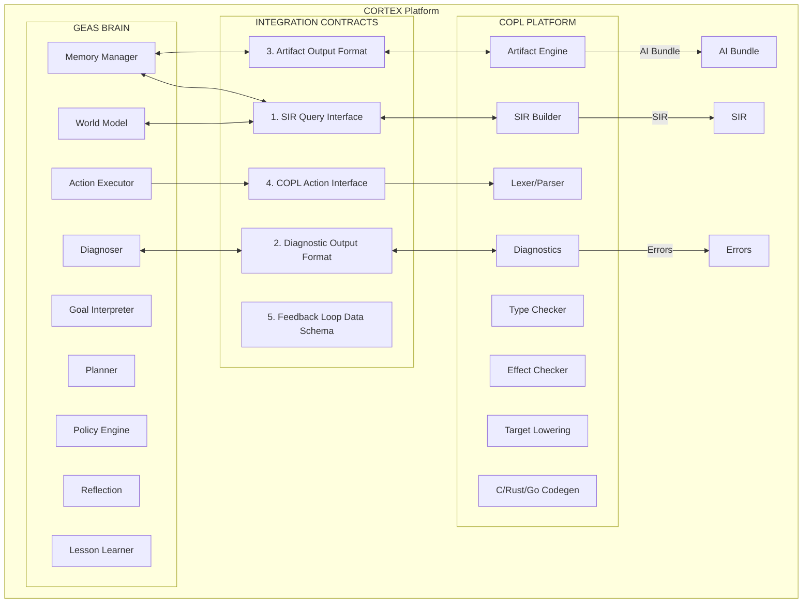

# Cortex — Nền tảng Hợp nhất GEAS và COPL (Unified GEAS + COPL Platform)
## Tầm nhìn Hợp nhất (Unified Vision)

> **Phiên bản**: 1.0 | **Trạng thái**: Giai đoạn Lập kế hoạch (Planning Phase) | **Cập nhật lần cuối**: 2026-04-03

---

## 1. Cortex Là Gì?

**Cortex** là hệ sinh thái hợp nhất của hai dự án nòng cốt:
- **GEAS** — Tác nhân AI (AI Agent) có khả năng lập kế hoạch, tự động thực thi và tự học từ kinh nghiệm thực tiễn.
- **COPL** — Ngôn ngữ lập trình được tích hợp bộ nhớ dự án và trình biên dịch (compiler) có khả năng nhận thức kiến trúc hệ thống.

Sự kết hợp này tạo ra:

> **Một Kỹ sư AI sở hữu ngôn ngữ lập trình riêng — mã nguồn được phát triển bằng COPL, được xác minh độ chính xác bởi trình biên dịch, tự động cải thiện năng lực qua từng dự án và tối ưu hóa hiệu suất theo thời gian.**

```
Cortex = GEAS (Bộ não / Brain) + COPL (Ngôn ngữ + Trình biên dịch)

Đầu vào (Input):  "Build EVCU firmware for STM32F407"
Đầu ra (Output): Dự án COPL hoàn chỉnh → Tự động sinh mã đích (C code) → Tạo các tệp Artifacts → Lưu trữ bài học kinh nghiệm (Lessons learned)
```

## 2. Mục Tiêu Tích Hợp

### GEAS cần COPL để hoạt động:

| Yêu cầu của GEAS | Giải pháp từ COPL |
|---|---|
| Mô hình thế giới (World model) có cấu trúc | Lược đồ SIR — Biểu diễn dự án theo mô hình ngữ nghĩa |
| Phản hồi lỗi có cấu trúc (Structured error feedback) | 5 lớp cảnh báo chẩn đoán từ Compiler (Compiler diagnostics) có phân loại |
| Dữ liệu huấn luyện (Training data) | Mỗi chu kỳ biên dịch (Compile cycle) tương đương 1 tiến trình đo lường (structured episode) |
| Kiểm chứng mã nguồn | Type checker + Effect checker + Profile checker |

### COPL cần GEAS để tự động hóa:

| Yêu cầu của COPL | Giải pháp từ GEAS |
|---|---|
| Tác nhân AI phân tích Artifacts | Bộ diễn giải Mục tiêu (Goal Interpreter) + Trình quản lý Bộ nhớ (Memory Manager) |
| Tự động viết và gỡ lỗi (Debug) | Bộ thực thi Hành động (Action Executor) + Trình chẩn đoán (Diagnoser) |
| Lập kế hoạch kiến trúc dự án | Trình định tuyến phân cấp (Hierarchical Planner) |
| Liên tục cải thiện quy trình | Khối Cập nhật bài học (Lesson Learner) + Tối ưu hóa Chiến lược (Policy Adapter) |

### Hiệu ứng Bánh đà (Flywheel Effect)

```
GEAS viết code COPL → Trình biên dịch tạo ra Artifacts → Artifacts đóng vai trò là dữ liệu huấn luyện (Training data)
→ GEAS tự tối ưu hóa thông qua dữ liệu → Kỹ năng viết mã COPL tốt hơn → ... (Vòng lặp phản hồi tích cực - Positive feedback loop)
```

## 3. Định Vị Sản Phẩm (Product Positioning)

```
GitHub Copilot:   Lập trình viên viết mã → AI đưa ra gợi ý
Devin:            Lập trình viên giao tác vụ → AI viết mã (phụ thuộc ngôn ngữ truyền thống)
Cortex:           Lập trình viên xác định mục tiêu → AI đảm nhiệm TOÀN BỘ VÒNG ĐỜI DỰ ÁN
                  bằng ngôn ngữ COPL bản địa → Trình biên dịch xác minh
                  → Sản sinh mã đích + tạo Artifacts + lưu trữ kiến thức nội bộ
```

**Lợi thế cạnh tranh (Competitive moat)**: Kiến trúc duy nhất trên thế giới sở hữu cả ngôn ngữ lập trình đặc tả và hệ thống Tác nhân AI tích hợp (AI Agent) đi kèm.

## 4. Cấu Trúc Kiến Trúc Hợp Nhất (Unified Architecture)



## 5. Chiến Lược Phát Triển (Development Strategy)

### Ưu Tiên COPL, Song Song Thiết Kế GEAS

```
Giai đoạn 1 (Tháng 1-4):  Hoàn thiện hệ sinh thái vi xử lý trung tâm COPL compiler.
                          Lên thiết kế kiến trúc GEAS (chỉ ở mức tài liệu, chưa mã hóa phần mềm).
                          Sử dụng Mock GEAS Agent để kiểm chứng hợp đồng hệ thống (validate contracts) trong CI.

Giai đoạn 2 (Tháng 5-7):  Bắt đầu triển khai lập trình GEAS (Cú pháp COPL Grammar đã chốt cấu hình).
                          Bảo trì COPL + Sửa lỗi phần mềm (bug fixes).

Giai đoạn 3 (Tháng 8-10): Tích hợp luồng thực thi liên tục GEAS ↔ COPL.
                          Xây dựng mô hình kiểm thử toàn trình (End-to-end demos).

Giai đoạn 4 (Tháng 11-14): Hoàn thiện chất lượng mã, huấn luyện hệ thống trên diện rộng (Training at scale), và chuẩn bị phát hành (Release).
```

Cơ sở ưu tiên COPL trước:
1. Độ trễ hoặc cấu trúc thiếu ổn định của Grammar trong giai đoạn đầu có nguy cơ phá vỡ toàn bộ dữ liệu huấn luyện của GEAS.
2. COPL có khả năng triển khai độc lập (con người có thể tương tác trực tiếp), trong khi GEAS phụ thuộc 100% vào nền tảng COPL.
3. Chuyên gia phải xác minh và đánh giá tính chính xác của Trình biên dịch trước khi để AI tương tác.
4. Xây dựng nền tảng tiêu chuẩn là tiến trình bắt buộc đối với mọi thiết kế công nghệ phần mềm cốt lõi.

### 5 Đầu Mục Hợp Đồng Tích Hợp (Integration Contracts)

Các quy ước API nền tảng này cần được thiết kế và cố định trước (Design-First) cho cả phía COPL và GEAS:

1. **SIR Query Contract** — Giao thức chuẩn cho hệ World Model của GEAS truy xuất mô hình SIR.
2. **Diagnostic Contract** — Bộ quy tắc chẩn đoán lỗi (Log format) chuẩn bị theo luồng kỹ thuật riêng.
3. **Artifact Contract** — Cấu trúc API cho GEAS Memory nạp thẻ tóm tắt (summary cards) và ma trận dấu vết (trace matrix).
4. **Action Contract** — Giao diện cho GEAS Executor gửi lệnh trực tiếp vào COPL compiler.
5. **Episode Schema Contract** — Định dạng chuẩn cho GEAS tạo dữ liệu huấn luyện từ kết quả trả về của chu trình compile.

*Mock GEAS Agent sẽ liên tục chạy nhầm trong hệ thống Continuous Integration (CI) để tự động kiểm thử toàn bộ các Contract hàng ngày.*

## 6. Giải Quyết Vấn Đề Chuyển Đổi Quy Mô (Scale Considerations)

| Thách Thức Kỹ Thuật | Phương Án Thiết Kế (Giải pháp) |
|---|---|
| Dung lượng dự án mã lên tới 30GB | Chỉ mục hoá toàn bộ bằng SIR index (~150MB) → Ưu tiên truy xuất (query) thay vì nạp (load) hệ thống cấp toàn phần. |
| Lưu giữ kiến thức qua thời gian dài | Vận hành Bộ nhớ Ngoại vi bền vững (External memory qua CSDL SQLite). |
| Quản lý tương tác song song của nhiều Git branches | Lập chỉ mục Bộ nhớ theo cấu trúc Phân luồng Branch (Tagged by branch). |
| Tổ chức lượng lớn luồng kiểm thử | Khởi tạo Lớp điều phối kiểm thử đa chu trình (Test orchestration layer): Unit → Integration → HIL. |
| Hiện tượng thoái hóa Trí nhớ | Kiến trúc Lưu trữ Phân cấp theo truy vấn kết hợp dọn rác tự động (Hierarchical retrieval & compaction). |
| Tối ưu việc biên dịch luồng dữ liệu | Cấu hình cơ chế Biên Dịch Gia Số (Incremental compilation) dựa trên Đồ thị phụ thuộc (Dependencies). |

## 7. Thị Trường Mục Tiêu (Target Market)

**Thị trường cốt lõi (Primary)**: Ngành Hệ thống Nhúng (Embedded System) / Ô Tô (Automotive) / Công nghệ An toàn chức năng (Safety-critical ISO 26262)
- Có yêu cầu nghiêm ngặt về khả năng truy vết (Traceability) → COPL hỗ trợ gốc lập trình (Native).
- Biên dịch Mã phức tạp (Complex codegen) → COPL áp dụng biên dịch đa đích (Multi-target).
- Tuổi đời của Dự Án Dài → Tối ưu hóa nhờ mô hình Trí nhớ dài hạn của thiết bị GEAS.
- Nhu cầu Phát triển với hỗ trợ của AI (AI-assisted development) → Gói tiêu chuẩn Cortex đảm nhận toàn diện (Full package).

**Thị trường thứ cấp (Secondary)**: Ứng dụng Backend System, kiến trúc phức hợp đa team (Multi-team projects).

## 8. Bản Đồ Hệ Thống Tài Liệu Kỹ Thuật

```
docs/
├── copl/                    ← 13 files — Hệ sinh thái ngôn ngữ COPL
│   ├── 00_overview.md       ← Giải thích cốt lõi về COPL, kiến trúc cấu thành
│   ├── 01-12 ...            ← Tiêu chuẩn Đặc tả chi tiết (Specs detailed)
│
├── geas/                    ← 11 files — Mảng định tuyến Tác nhân AI GEAS 
│   ├── 00_overview.md       ← Đặc tuyến sơ quát liên hợp (GEAS là gì, 12 modules)
│   ├── 01-10 ...            ← Đặc tả AI Backend kỹ thuật cho GEAS
│
└── cortex/                  ← 7 files — Giao thức Hợp Nhất (Unified Protocol) 
    ├── 00_unified_vision.md ← THƯ MỤC HIỆN TẠI BẠN ĐANG XEM
    ├── 01_integration_contracts.md ← 5 đặc tả hợp đồng Giao tiếp chuẩn ranh giới Interface
    ├── 02_project_management.md    ← Phương pháp Quản trị Giai đoạn Dự án, Mốc Quality Gates
    ├── 03_work_rules.md            ← Quy tắc Tiêu chuẩn Lập trình (Coding Standards)
    ├── 04_ai_handoff.md            ← Giao thức luân chuyển Hand-off liên mạng giữa các Tác nhân AI
    ├── 05_risk_mitigation.md       ← Ma Trận Định Vị Tính Năng Rủi Ro Hệ Thống
    └── 06_project_governance.md    ← Triết lý cấu trúc (Governance) quy phạm cấp toàn quyền Hệ Thống
```

## 9. Bảng Thuật Ngữ Hợp Nhất (Glossary)

| Thuật ngữ | Khởi nguồn | Định nghĩa Kỹ thuật |
|---|---|---|
| **Cortex** | Nguyên bản | Hệ thống sản phẩm hợp nhất nguyên bản tích hợp giữa công nghệ điều phối GEAS và trình thiết kế ngôn ngữ COPL. |
| **SIR** | COPL | Semantic Intermediate Representation — Biểu diễn mã nguồn dưới dạng đồ thị cấu trúc và ngữ nghĩa cao cấp. |
| **Episode** | GEAS | Đơn vị thu thập thông tin trải nghiệm/hành động tối giản của một vòng lặp Tác nhân phân tích. |
| **Integration Contract** | Cortex | Bộ giao thức tiêu chuẩn ràng buộc ranh giới kết nối của các Module xử lý chéo giữa Hệ GEAS & COPL. |
| **Mock Agent** | Cortex | Phiên trình Tác Nhân kiểm soát hệ quy chiếu tích hợp (CI tests pipeline) được sử dụng đánh giá xác định Contract. |
| **Flywheel** | Cortex | Thuật toán tối ưu hóa vòng lặp phản hồi tích cực (Positive feedback loop) gồm chu trình tự tối ưu hóa: viết mã → Học rút kinh nghiệm vòng lặp → Cải thiện luồng code thông minh hơn. |
| **Proto-COPL** | Cortex | Giao thức dữ liệu định dạng JSON cầu nối tạm cấp dữ liệu thực hành trong quá trình xây thô Trình Biên dịch COPL. |
