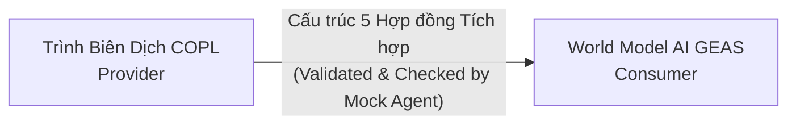

# Các Hợp đồng Tích hợp của Cortex (Integration Contracts)
## 5 Giao thức Ràng buộc Tiêu chuẩn — Hỗ trợ tinh chỉnh X1-X5

> **Trạng thái**: Bản nháp | **Cập nhật lần cuối**: 2026-04-03

---

## 1. Vai trò của Các Hợp đồng Tích hợp

Do COPL được định tuyến phát triển trước GEAS, các Hợp đồng tích hợp đóng vai trò nhằm bảo toàn tuyệt đối 100% khả năng tương thích của hai nền tảng cốt lõi:



## 2. Hợp đồng #1: Giao thức Truy vấn SIR (SIR Query Interface)

**Dịch vụ Cung cấp (Provider)**: COPL Compiler | **Đội Nhận (Consumer)**: Bộ khởi tạo GEAS World Model

```python
class SIRQueryContract:
    """Các hàm khai báo bắt buộc mà hệ thống COPL phải hỗ trợ đầy đủ cho GEAS World Model gọi cấu trúc truy xuất dữ liệu."""
    
    def get_workspace(self) -> SIRWorkspace:
        """Trả về toàn bộ định dạng chuẩn của lược đồ biểu diễn dạng SIR nội hàm."""
    
    def get_module(self, name: str) -> SIRModule:
        """Trả về đồ thị SIR cụ thể đối với một module theo định kiểu quy ước trước."""
    
    def get_modules_by_status(self, status: str) -> list[SIRModule]:
        """Sàng lọc danh mục tất cả module đang thụ hưởng một trường Status định dạng nào đó."""
    
    def get_dependencies(self, module: str) -> list[DependencyEdge]:
        """Dò trích xuất toàn bộ luồng ràng buộc phụ thuộc trực tiếp của một module cụ thể."""
    
    def get_trace_coverage(self) -> TraceMatrix:
        """Kết xuất cấu hình Full Trace Matrix bao hàm tất cả tham số %. của Coverage."""
    
    def get_unimplemented_requirements(self) -> list[SIRRequirement]:
        """Tập hợp những Yêu cầu thiết kế (Requirements) hiện đang rỗng, thiếu Code Trace kết nối thực thi."""
    
    def get_untested_requirements(self) -> list[SIRRequirement]:
        """Liệt kê các Yêu cầu thiết kế chưa được phủ Kiểm thử (Test coverage)."""
    
    def get_module_risk(self, module: str) -> float:
        """Thống kê Chỉ số Rủi ro của Module theo hệ đánh giá rủi ro từ 0.0 - 1.0 ."""
    
    def search(self, query: str) -> list[SIRModule]:
        """Tìm kiếm chuỗi phân mảnh nâng cao xuyên suốt tất cả Name/Purpose của Module thuộc hệ thống dự án."""

# Unit Test Kiểm Chứng (Validation test)
def test_sir_query_contract(compiler, test_project):
    result = compiler.compile(test_project)
    query = SIRQueryContract(result.sir)
    
    ws = query.get_workspace()
    assert ws.name is not None
    assert ws.computed.total_modules > 0
    
    modules = query.get_modules_by_status("stable")
    for m in modules:
        assert m.context.purpose is not None
        assert m.context.status == "stable"
        assert m.computed.risk_score >= 0.0
    
    coverage = query.get_trace_coverage()
    assert 0.0 <= coverage.computed.overall_coverage <= 1.0
```

## 3. Hợp đồng #2: Định dạng Cấu trúc Chẩn Đoán Lỗi (Diagnostic Output Format)

**Dịch vụ Cung cấp (Provider)**: COPL Compiler | **Đội Nhận (Consumer)**: Cấp chẩn đoán lỗi GEAS (GEAS Diagnoser)

```python
@dataclass
class DiagnosticContract:
    """Thiết lập cấu trúc đặc tả 100% cho mọi kết xuất Error Diagnostic, hệ thống không chấp nhận dữ liệu ngoại lệ."""
    
    category: str      # Phân chia: "syntax" (Cú pháp) |"semantic" (Ngữ nghĩa) |"profile"|"lowering"|"architecture"
    severity: str      # Cấp độ: "error"|"warning"|"info"
    code: str          # Mã quy chuẩn mã code theo hệ trục (Ví dụ: "E001", "W023")
    message: str       # Khối text dạng Human-readable có cấu trúc chuẩn chẩn đoán
    file: str          # Thông tin vị trí lưu File Path
    line: int          # Dòng số lượng dòng truyển chẩn (1-indexed)
    column: int        # Cột (1-indexed)
    suggested_fix: str # Dữ liệu khuyên dùng hỗ trợ AI Agent xử lý bắt lỗi sửa code
    related: list[str] # Điểm tham chiếu dây chuyền (Tên REQ-xxx, cấu trúc tên Function module.name)

# Unit Test Kiểm Chứng (Validation test)
def test_diagnostic_contract(compiler):
    result = compiler.compile("test_data/errors/type_mismatch.copl")
    assert not result.success
    
    for diag in result.diagnostics:
        assert diag.category in ["syntax", "semantic", "profile", "lowering", "architecture"]
        assert diag.severity in ["error", "warning", "info"]
        assert diag.code.startswith(("E", "W"))
        assert len(diag.code) >= 4
        assert len(diag.message) > 0
        assert diag.line > 0
        assert diag.column > 0
```

## 4. Hợp đồng #3: Giao thức Biểu diễn Artifact Format (Artifact Output Format)

**Dịch vụ Cung cấp (Provider)**: COPL Artifact Engine | **Đội Nhận (Consumer)**: Khối Ghi nhớ thông tin của GEAS (GEAS Memory Manager)

```python
class ArtifactContract:
    """Khuôn dạng mấu chốt Artifacts schema. Bất cứ lần điều chỉnh cấu trúc nào buộc cập nhật chuỗi Version Bump."""
    
    SUMMARY_CARD_REQUIRED_FIELDS = [
        "module_name", "purpose", "owner", "status", "profile",
        "metrics.function_count", "metrics.loc",
        "quality.trace_coverage", "quality.risk_score",
        "effects", "dependencies", "trace"
    ]
    
    DEP_GRAPH_REQUIRED_FIELDS = [
        "nodes[].id", "nodes[].type", "nodes[].status",
        "edges[].from", "edges[].to", "edges[].type"
    ]
    
    TRACE_MATRIX_REQUIRED_FIELDS = [
        "entries[].requirement_id", "entries[].implemented_by",
        "entries[].tested_by", "entries[].coverage",
        "summary.overall_coverage"
    ]

# Unit Test Kiểm Chứng (Validation test)
def test_artifact_contract(compiler, test_project):
    result = compiler.compile(test_project)
    artifacts = result.artifacts
    
    for card in artifacts.summary_cards:
        for field in ArtifactContract.SUMMARY_CARD_REQUIRED_FIELDS:
            assert get_nested(card, field) is not None, f"Missing component field: {field}"
    
    graph = artifacts.dependency_graph
    assert len(graph["nodes"]) > 0
    assert len(graph["edges"]) >= 0
    
    matrix = artifacts.trace_matrix
    assert 0.0 <= matrix["summary"]["overall_coverage"] <= 1.0
```

## 5. Hợp đồng #4: Lệnh Tương Tác COPL Action (COPL Action Interface)

**Dịch vụ Cung cấp (Provider)**: COPL CLI/API | **Đội Nhận (Consumer)**: GEAS Action Executor

```python
class ActionContract:
    """Các mệnh lệnh điều khiển của GEAS Executor đưa ra và bắt buộc giao diện COPL API phải thực thi chính thức."""
    
    def create_module(self, name: str, content: str) -> ActionResult:
        """Cấu trúc Cấp Phép Tạo Lập tệp code định tuyến kiểu .copl"""
    
    def modify_module(self, name: str, patch: str) -> ActionResult:
        """Cấp quyền bổ sung hoặc điều chỉnh cấu trúc vào bên trong tệp Code .copl hiện tại."""
    
    def delete_module(self, name: str) -> ActionResult:
        """Xoá bỏ kết cấu luồng tệp."""
    
    def build(self, target: str = "c") -> BuildResult:
        """Kịch bản Toàn Diện Build Code: Parse dữ kiện → Check toàn hệ → Target Code Generation."""
    
    def check(self) -> CheckResult:
        """Chi Trình Verify (Không nhả target): Chỉ Parse, chạy luồng Type Check & Effect Check."""
    
    def run_tests(self, suite: str = "all") -> TestResult:
        """Chạy mảng cấu hình cấu trúc Test Framework."""
    
    def emit_artifacts(self) -> ArtifactResult:
        """Kích phát cơ chế trích xuất AI bundle package toàn dự án."""
    
    def get_sir(self) -> SIRWorkspace:
        """Trả về đồ thị luồng Trạng thái SIR."""

@dataclass
class BuildResult:
    success: bool
    diagnostics: list[Diagnostic]
    output_files: list[str]
    sir: SIRWorkspace
    artifacts: ArtifactBundle
    duration_ms: int

# Unit Test Kiểm Chứng (Validation test)
def test_action_contract():
    api = ActionContract(workspace="test/")
    
    r1 = api.create_module("test.hello", 'module test.hello {}')
    assert r1.success
    
    r2 = api.build(target="c")
    assert isinstance(r2.success, bool)
    assert isinstance(r2.diagnostics, list)
    assert r2.sir is not None
    
    r3 = api.check()
    assert isinstance(r3.success, bool)
```

## 6. Hợp đồng #5: Mô Hình Biểu diễn Tập Luyện của AI Dạng Lớp Lưới (Episode Data Schema)

**Dịch vụ Cung cấp (Provider)**: COPL Output Results | **Đội Nhận (Consumer)**: Tầng Huấn luyện của luồng Pipeline Training GEAS.

```python
@dataclass
class EpisodeSchemaContract:
    """Quy chuẩn toàn diện để chuyển giao Episode phục vụ AI Training Machine."""
    
    # Số dọ liệu Trước Vòng Khớp Lệnh (Before action)
    state_modules: int
    state_functions: int  
    state_errors: int
    state_trace_coverage: float
    state_build_status: str
    
    # Biểu Trạng Lệnh Thực thi (Action taken)
    action_type: str
    action_args: dict
    
    # Cục Diện Rủi ro / Thay đổi Hậu thực Thi (After action)
    outcome_success: bool
    outcome_class: str
    new_errors: int
    resolved_errors: int
    new_trace_coverage: float

# Unit Test Kiểm Chứng Schema
def test_episode_schema(compiler, test_project):
    sir_before = compiler.get_sir()
    state_before = extract_state(sir_before)
    
    compiler.create_module("test.new_module", MODULE_CONTENT)
    result = compiler.build()
    sir_after = compiler.get_sir()
    
    state_after = extract_state(sir_after)
    
    episode = EpisodeSchemaContract(
        state_modules=state_before.module_count,
        state_functions=state_before.function_count,
        state_errors=state_before.error_count,
        state_trace_coverage=state_before.trace_coverage,
        state_build_status=state_before.build_status,
        action_type="create_module",
        action_args={"name": "test.new_module"},
        outcome_success=result.success,
        outcome_class="success" if result.success else "compile_error",
        new_errors=max(0, state_after.error_count - state_before.error_count),
        resolved_errors=max(0, state_before.error_count - state_after.error_count),
        new_trace_coverage=state_after.trace_coverage
    )
    
    # Luôn luôn Phải tuân theo định dạng JSON Serialization
    json_str = json.dumps(asdict(episode))
    roundtrip = EpisodeSchemaContract(**json.loads(json_str))
    assert roundtrip == episode
```

## 7. Quy trình Phê chuẩn CI Hệ thống Tích hợp Tự động (CI Integration)

```yaml
# .github/workflows/contract_validation.yml
name: Tích hợp Giao ước Kiến trúc Phân vùng GEAS
on: [push, pull_request]

jobs:
  contracts:
    runs-on: ubuntu-latest
    steps:
      - uses: actions/checkout@v4
      - name: Build hệ lõi trình biên dịch COPL compiler
        run: make copc
      - name: Auto-Test Hợp đồng Kiến Trúc 
        run: |
          pytest tests/contracts/test_sir_query.py
          pytest tests/contracts/test_diagnostics.py
          pytest tests/contracts/test_artifacts.py
          pytest tests/contracts/test_actions.py
          pytest tests/contracts/test_episode.py
      - name: Run Trạng Thái Tác Nhân Giả Lập Agent (Mock GEAS Agent)
        run: pytest tests/contracts/test_mock_agent.py
      - name: Fail an toàn trên lỗi Cấu Hình Khớp Luồng Contract (Safe Error Catch Override)
        if: failure()
        run: echo "🔴 RỦI RO GEAS HỢP ĐỒNG KHÔNG TƯƠNG THÍCH — BUỘC XỬ LÝ KHẨN CẤP TRƯỚC KHI MERGE"
```
