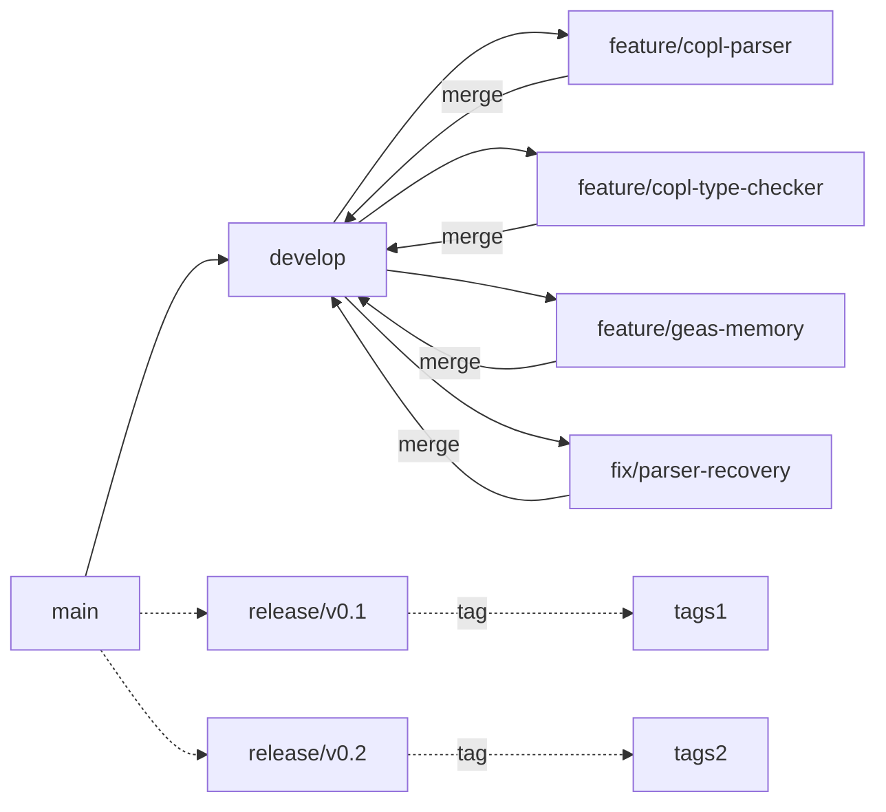

# Quy định Môi trường Làm việc Cortex (Work Rules)
## Tiêu Chuẩn Mã Nguồn, Chế độ Báo cáo, Quy Trình Phê Duyệt

> **Trạng thái**: Bản nháp | **Cập nhật lần cuối**: 2026-04-03

---

## 1. Hệ Tiêu Chuẩn Viết Mã (Code Standards)

### 1.1 Khối Công Nghệ COPL Compiler (Dựa trên nền Rust/Python)

```
- Ngôn ngữ: Ưu tiên ngôn ngữ Rust cho cốt lõi compiler, Python hỗ trợ cho mảng tooling
- Định Dạng Code (Formatting): Ràng buộc formatter chuẩn `rustfmt` / `black` (Tự động thiết lập check qua CI pipeline)
- Nguyên tắc Đặt Tên (Naming): 
  - Khởi tạo hàm (functions/variables): `snake_case`
  - Các hệ type/structs: Tương đương `PascalCase`
- Yêu cầu Đặc tả Tài Liệu (Documentation): Các API Hàm public buộc chèn thêm `docstring` đầy đủ thông tin
- Kiểm thử (Tests): Mỗi đơn vị thiết kế Module file có test file liên kết độc lập ràng buộc song song.
- Mô tả Phương trình Báo Lỗi (Error handling): Bao quanh trả đồ về là `Result/Option`. Tuyệt đối cấm khai mở `unwrap()` bên trong môi trường library code
- Giới hạn Khối xử lý dòng lệnh (Max function length): Giới hạn < 50 dòng (Nâng quy chuẩn Extract phân tách nếu vượt ngưỡng)
- Mật độ tối đa File code: Tỷ số cận < 500 dòng (Chia luồng Tách Split nếu nặng hơn)
```

### 1.2 Phân Tuyến GEAS Agent (Dựa trên Python)

```
- Nền tảng: Biên dịch bằng Python > 3.11+
- Chuẩn Định Dạng (Formatting): Sử dụng `black` + `isort` (Quy định bắt lỗi tự động automated pipeline)
- Gõ Chú Thích Kiểu Dữ liệu (Type hints): 100% Required (Bắt buộc thiết đặt tĩnh cho public hàm xử lý)
- Đặt tên (Naming): Functions (`snake_case`), Classes (`PascalCase`)
- Định cấu Doc (Documentation): Triển khai Google-style docstrings
- Framework Tests: Cài đặt pytest, Chỉ sổ Coverage báo kết ở cấu hình cao (tối thiểu 80%)
- Trạng thái Tham chiếu Dependencies: Định danh cụ thể Pinned versions qua màng lọc requirements.txt files
- Mô Phỏng Model AI code: Nhúng trên engine PyTorch, Dán nhãn type-annotated đối với hệ tính toán tensors.
```

### 1.3 Quy Chuẩn Documentation (Tài liệu Thuyết minh Thiết Kế)

```
- Format File: Ưu tiên Markdown phổ quát chuyên ngành
- Naming rules conventions: Định dạng số thẻ `NN_descriptive_name.md` (e.g., 01_grammar_spec.md)
- Tiêu đề Đầu file Metadata (Headers): Khai thông Version, Hiện trạng Status, Ngày Cập nhật (Last updated)
- Hướng dẫn Khai triển Code (Code examples): Yêu cầu đính 01 ví dụ liên đới khi soạn thảo file tính năng thuật toán specification module.
- Chế Độ Chỉ mục tham khảo (Cross-references): Bật Liên kết tương đối (Link via relative paths) thay vì hard code.
```

## 2. Tiêu Chuẩn Thao tác Điều phối Git (Git Workflow)



### Định Tên Mã Cấu trúc Chi Nhánh (Branch Naming)

```
feature/copl-{component}     Nhánh xây dựng Feature hệ sinh thái COPL
feature/geas-{component}     Nhánh phác thảo Component mới bên trong GEAS Engine
fix/{short-description}      Tuyến dành tiêng tập trung vá Bug fixes khẩn
docs/{area}                  Tuyến dành chỉ Update Documentations liên chuyên ngành thư viện code
test/{area}                  Tuyến bổ sung dữ kiện Test/Mock Tests Additions
```

### Quy Chuẩn Thông Báo Commit Messages

```
Kiến trúc Dữ Liệu: [{component}] {verb(Hành động)} {description (Nội dung súc tích nhất)}

Ví dụ cụ thể (Examples):
  [copl-parser] Add state machine grammar rules
  [copl-types] Fix bidirectional inference for closures
  [geas-memory] Implement EWC regularization
  [contracts] Add SIR query contract validation tests
  [docs] Update lowering spec with enum codegen
```

## 3. Quy Trình Review Chất lượng Hệ Đóng (Review Process)

### Bản Mẫu Điền Báo Pull Request (Pull Request Template)

```markdown
## Tóm Tắt Diễn Biến Sự Cố (Summary)
Brief description of changes.

## Chọn Phương Lược Cấu Trúc (Type)
- [ ] Thêm Tính Năng Cốt Code (Feature)
- [ ] Xử Lý Lập Trình Fix (Bug fix)
- [ ] Tu bổ Chuyên Ngành Docs (Documentation)
- [ ] Tuổ Bỏ Bộ Test Kế Nối (Test)
- [ ] Tối Ưu Hóa Dữ Liệu Lỗi (Refactor)

## Các Lệnh Chế Tài Ràng Buộc Hỗ Trợ (Related)
- Fixes issue mã số #{issue}
- Related to issue #{issue}
- Lỗ hổng weakness được đính kèm addressed report number: {C1/G3/X5/...}

## Tác Động Qua Lại Chặn Biên Dịch (Testing)
- [ ] Unit tests added/updated - Đã xác thực thành công báo cáo test.
- [ ] Contract tests pass - Module Contracts chéo biên giới hoạt động
- [ ] Manual testing done - Xác minh Test code qua thủ công đạt điểm 10/10

## Chặng Kiểm Tra Phê (Checklist)
- [ ] Code formatted (chuẩn format rustfmt/black)
- [ ] Documentation updated
- [ ] No new warnings - Hủy kích hoạt warning ẩn
- [ ] Lập biên bản nếu gây ra Breaking changes documented (định vị điểm dừng cấp Break)
```

### Điều Kiện Cấp Quyển Xác Nhận Review Kéo Code (Review Criteria)

```
Danh mục xét duyệt trước khi Kéo Code Branch (Required for merge):
  □ Ít nhất một Approval Confirm (Approve)
  □ Hệ thống CI xanh vượt kiểm tra báo Test Automation thành công Green Flag.
  □ Contract tests báo Pass hệ thống
  □ KHÔNG tồn đọng các bình định Comments chưa đóng (No unresolved comments)
  □ Hệ thống API Specification báo có Update Data.
```

## 4. Đặc Tả Thiết Tố Yêu Cầu Về Bài Kiểm Thử (Testing Requirements)

```
100% PR tạo ra yêu cầu bắt buộc:
  - Khai báo bổ sung Unit tests chuyên trách khi viết new source code
  - Kèm theo Contract tests khi chạm trán sự cố chệch module Interface changes.
  - Phù cập Integration test với phân quyền mã tương tác cấp độ Cross-module changes

Target Điểm Cover Tối Thiểu Cấu Trúc Code Trả Về (Coverage requirements):
  - Khối Parser (Bộ Phân Tích Cú pháp): Tính Phủ Mọi Dòng >= 90% (line coverage)
  - Khối Type Checker (Kiểm Tra Điểm Loại Nhắn): Đạt ngưỡng >= 85%
  - Bộ Mã Hóa Sinh Code C (Codegen): Tối thiểu >= 80% (line coverage)
  - Tầng kiến trúc lớp GEAS modules ảo AI Engine: >= 80% (line coverage)
  - Mẫu số Chung Dự Án Thống Nhất Tổng (Overall Avg Target): >= 85%
```

## 5. Phương Lược Tổ Chức Giao Tiếp Quản Trị (Communication)

### Tọa Đàm Chấn Chỉnh Nhanh (Daily Standup) (Giới Hạn 15 Phút)

```
Lịch trình Báo cáo nhanh Cấp Nhân Sự:
  1. Tổng kết task đã chốt kết sổ của ngày giao ban hôm qua
  2. Mục Tiêu Lịch xử lý Code cho ngày vận hành làm số liệu hôm nay 
  3. Cảnh báo Nếu Xuất Hiện Các Blockers treo cản hệ công cụ
```

### Tham Vấn Toàn Nghành Hệ Hệ Core (Weekly Review) (Đúng 1 Tiếng)

```
Kế hoạch Giao Ước Thường Nham (Agenda):
  1. Thuyết Minh Đóng gói Trình Duyệt Demos sản lượng (Gắn kết định mức 10 phút/Cá Nhân)
  2. Truy Thăm Sóng Board Tracking Đóng Bảng Metrics Dashboard (10 phút)
  3. Xuyên Suốt Mọi Bài Toán Vướng Blockers vs Phân Tích Rủi Ro Project Risks (15 phút)
  4. Lập Dự Toán Code Phân Chia Kế hoạch Tuần Tới (15 phut)
```
